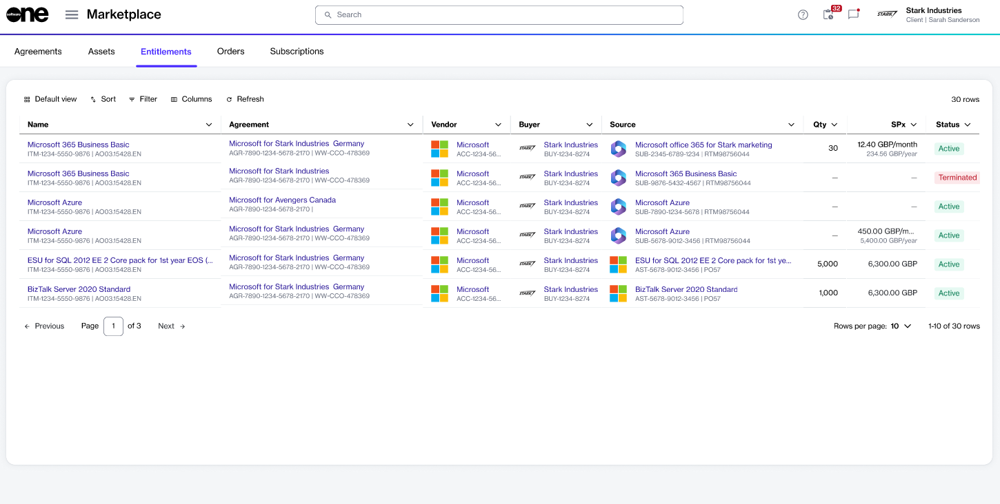

# Entitlements

An entitlement refers to the item you have purchased, along with the quantity you are allowed to use.&#x20;

Entitlements can include subscription items that renew at predefined intervals unless canceled, as well as your [assets](../assets/), which are one-time purchases.

Each entitlement includes the item itself and the allowed quantity. For example, if you purchase 25 Microsoft 365 licenses, your entitlement allows you to use that product for up to 25 users. Within the platform, each entitlement is associated with either a subscription or a one-time purchase and is linked to a specific agreement and order under which it was purchased.

### Viewing entitlements

To view your entitlements, navigate to the **Entitlements** page within the platform.&#x20;

This page displays a list of your purchased items, along with the ordered quantity. You can also view information, such as the item name, estimated sales price, status, and more. Additionally, you can view the **source**, which indicates whether the entitlement is linked to a subscription or an asset.

To customize the list, use the [sorting and filtering options](../../../marketplace-platform/getting-started/interface/customize-the-data-grid.md) and [show or hide specific columns](../../../marketplace-platform/getting-started/interface/customize-the-data-grid.md#managing-columns) as needed.&#x20;

<figure><figcaption>
The Entitlements page in the platform.
</figcaption></figure>


You can also view your entitlements on other pages within the platform, such as the **Entitlements** tab within the [agreement details](../agreements/#subscription-details) and [order details](../orders/#order-details) pages. If the source of your entitlement is a subscription or an asset, you can also find relevant information on the [subscription details](../subscriptions/#subscription-details) and [asset details](../assets/#subscription-details) pages, respectively.


### Viewing entitlements details 

On the entitlement's details page, you can view extended information. Some information on the details page is read-only, while others include links, allowing you to navigate to further details.

To view the extended information for entitlement:

1. Navigate to the **Entitlements** page.
2. (Optional) Use filters to find the desired entitlement.
3. Select the entitlement to view the general information, such as the billing model, billing period, commitment term, and more.
4. Use the following tabs to access additional related information:
   * **Description** - Displays a description of the item.
   * **Price lists** - Displays price lists linked to the item.
