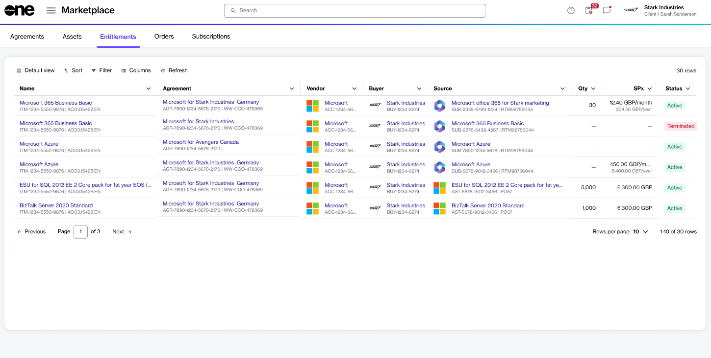

# Entitlements

An entitlement refers to the item you have purchased, along with the quantity you are allowed to use.&#x20;

Entitlements can include subscription items that renew at predefined intervals unless canceled, as well as your [assets](../assets/), which are one-time purchases.

Each entitlement includes the item itself and the allowed quantity. For example, if you purchase 25 Microsoft 365 licenses, your entitlement allows you to use that product for up to 25 users. Within the platform, each entitlement is associated with either a subscription or a one-time purchase and is linked to a specific agreement and order under which it was purchased.

### Viewing the list of entitlements

To view your list of entitlements, go to **Marketplace** > **Entitlements**.&#x20;

You can then view your purchased items, along with the ordered quantity. For each entitlement, you can also view details, such as the item name, estimated sales price, status, and more. Additionally, you can view the **source**, which indicates whether the entitlement is linked to a subscription or an asset.

<figure><figcaption>
The Entitlements page in the platform.
</figcaption></figure>


You can also view your entitlements on other pages within the platform, such as the **Entitlements** tab within the [agreement details](../agreements/#subscription-details) and [order details](../orders/#order-details) pages. If the source of your entitlement is a subscription or an asset, you can also find relevant information on the [subscription details](../subscriptions/#subscription-details) and [asset details](../assets/#subscription-details) pages, respectively.


### Viewing entitlements details 

On the **entitlement details** page, you can view detailed information for the entitlement. Some information on the details page is read-only, while others include links, allowing you to navigate to further details.

To view entitlement details:

1. Go to **Marketplace** > **Entitlements**.
2. Select the entitlement you want to view. The entitlement details page opens.
3. Use the tabs on the entitlement details page to view different types of information:
   * **Description** - Displays a description of the item.
   * **Price lists** - Displays price lists linked to the item.
