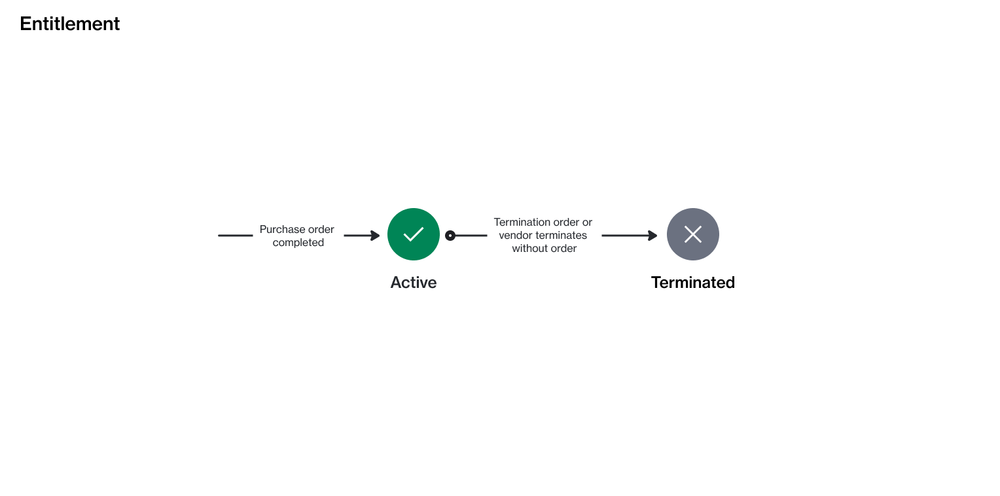

# Entitlement States

Entitlement refers to the item you have purchased, along with the quantity you are allowed to use.&#x20;

Entitlements can currently exist in two states: **Active** or **Terminated**. These states indicate whether the entitlement is currently valid or has been cancelled in the Marketplace Platform.

<figure><figcaption>
The state transition diagram of an entitlement.
</figcaption></figure>

<table data-full-width="false"><thead><tr><th width="152">State</th><th>Definition</th></tr></thead><tbody><tr><td><strong>Active</strong></td><td>The entitlement has been created as a result of a purchase order and is now available for use. This is the default state for entitlements that are currently in effect.</td></tr><tr><td><strong>Terminated</strong></td><td>
The entitlement has been terminated and is no longer valid. This can happen if the agreement or subscription associated with the entitlement is cancelled. 

Once the entitlement moves to <strong>Terminated</strong>, it can’t return to <strong>Active</strong>. 
</td></tr></tbody></table>
