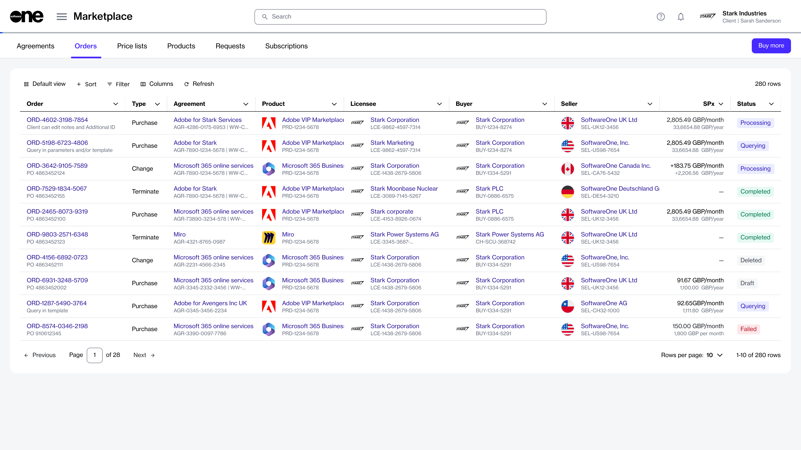
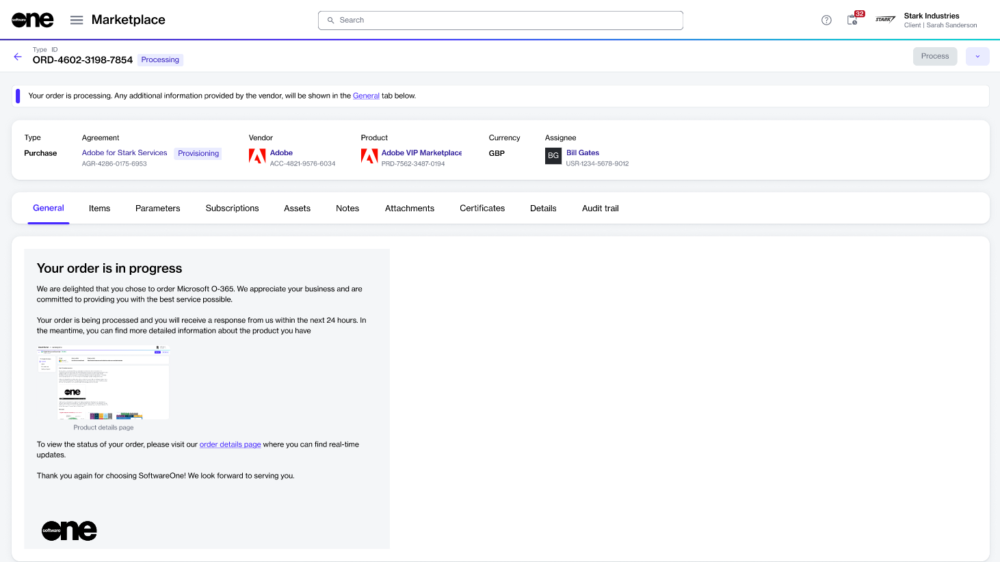

# Orders

The Marketplace Platform supports various types of orders, including:

* **Purchase orders** - A purchase order is created when you buy a new product or service by establishing a new agreement.
* **Change orders** - A change order is created when you modify the number of licenses for a subscription, for example, when you order additional licenses or reduce the quantity of current ones.
* **Terminate order** - A termination order is created when you want to end an active subscription or agreement.&#x20;
* **Configuration order** - A configuration order is created when you want to enable or disable the auto-renewal of a subscription.

### Viewing orders

To view your orders, navigate to the **Orders** page. When you launch the **Orders** page, all orders in your account are displayed.&#x20;

For each order, you can view information, such as the order number, linked agreement, product name, estimated sales price, status, and more. You can use the [sorting and filtering options](../../../marketplace-platform/getting-started/interface/customize-the-data-grid.md) to customize the list and [show or hide specific columns](../../../marketplace-platform/getting-started/interface/customize-the-data-grid.md#managing-columns) as needed.

For more information, see [How to Filter Orders](../../../marketplace-platform/getting-started/marketplace-for-clients/how-to-filter-your-orders.md).

<figure><figcaption>
The Orders page in the platform.
</figcaption></figure>

### Viewing order details 

On the order details page, you can view detailed information for your order. Some information is read-only, while others include links that allow you to navigate to further details.

To view the full details of an order:

1. Navigate to the **Orders** page.
2. (Optional) Use filters to find the desired order.
3. Select the order number to view basic information, such as order type, linked agreement, currency, and more.

<figure><figcaption>
The details page of an order. 
</figcaption></figure>

4. Use the following tabs to access additional related information:
   * **General** - Displays the most up-to-date information for the order.&#x20;
   * **Entitlements** - Displays the items you have purchased along with their details, including quantity, pricing, status, and more.
   * **Parameters** - Displays the order's fulfillment and ordering parameters.
   * **Entities** - Displays the entities linked to the order, including the licensee, buyer, and seller.
   * **Subscriptions** - Displays the subscriptions associated with the order and their details. Subscriptions are displayed only after they have been activated.
   * **Assets** - Displays assets or one-time items in the order. For more information on one-time items, see [Assets](../assets/).
   * **Notes** - Displays any notes entered during the ordering process. You can add or update these notes using the **Edit** option.
   * **Attachments** - Lists all files available for download under the agreement. For more information, see [View and Download Attachments](../agreements/view-and-download-attachments.md).
   * **Certificates** - Displays certificates used during the ordering process.
   * **Details** - Displays timestamps and additional IDs, including the client and vendor IDs.
   * **Audit trail** - Displays a record of events related to the order. For more information, see [Audit Trail](../../settings/audit-trail.md).&#x20;

## Additional actions

You can perform various actions on the details page. The available actions depend on the status of the order:

* [Delete a draft order](delete-draft-orders.md)
* [Submit your saved orders for processing](submit-draft-orders.md)
* [Manage the notes for your order](manage-order-notes.md)
* [Change your order's status to Processing](set-an-order-to-processing.md)
* [Send the order reminder email](send-order-reminder-email.md)
* [View and download attachments](../agreements/view-and-download-attachments.md)
