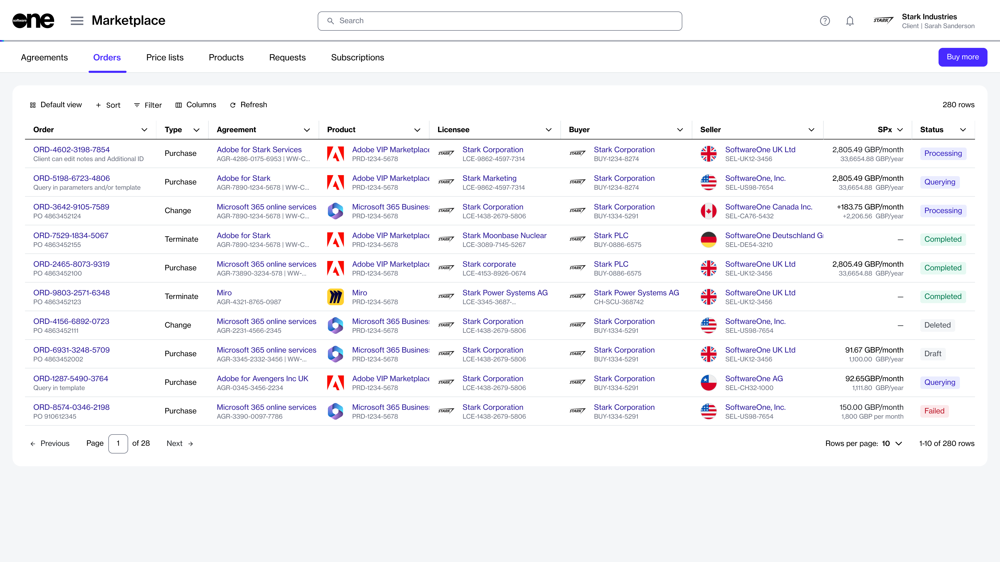

# Orders

In the SoftwareOne Marketplace, an order represents a business transaction created under an agreement. The following types of orders exist in the platform:

* **Purchase orders** - Created when you buy a new product or service by establishing a new agreement.
* **Change orders** - Created when you modify the number of licenses for a subscription, for example, when you order additional licenses or reduce the quantity of current ones.
* **Terminate order** - Created when you want to end an active subscription or agreement.&#x20;
* **Configuration order** - Created when you want to enable or disable the auto-renewal of a subscription.

### Viewing the list of orders

To view your orders, go to **Marketplace** > **Orders**.&#x20;

When you launch the **Orders** page, all orders in your account are displayed. For each order, you can view information, such as the order number, linked agreement, product name, estimated sales price, status, and more.&#x20;

You can use the [sorting and filtering options](../../../marketplace-platform/getting-started/interface/customize-the-data-grid.md) to customize the list and [show or hide specific columns](../../../marketplace-platform/getting-started/interface/customize-the-data-grid.md#managing-columns) as needed. For more information, see [How to filter orders](../../../marketplace-platform/getting-started/marketplace-for-clients/how-to-filter-your-orders.md).

<figure><figcaption>
The Orders page in the platform.
</figcaption></figure>

### Viewing order details 

On the **order details** page, you can view detailed information about an order. Some information is read-only, while other fields include links that allow you to navigate to related records.

To view order details:

1. Go to **Marketplace** > **Orders**.
2. Select the order you want to view. The order details page opens.
3. Use the tabs on the order details page to view different types of information:

<table><thead><tr><th width="200">Tab</th><th>Description</th></tr></thead><tbody><tr><td><strong>General</strong></td><td>Displays the most up-to-date information for the order. </td></tr><tr><td><strong>Entitlements</strong> </td><td>Displays the items you have purchased along with their details, including quantity, pricing, status, and more.</td></tr><tr><td><strong>Parameters</strong> </td><td>Displays the order's fulfillment and ordering parameters.</td></tr><tr><td><strong>Entities</strong></td><td>Displays the entities linked to the order, including the licensee, buyer, and seller.</td></tr><tr><td><strong>Subscriptions</strong></td><td>Displays the subscriptions associated with the order and their details. Subscriptions are displayed only after they have been activated.</td></tr><tr><td><strong>Assets</strong></td><td>Displays assets or one-time items in the order. For more information on one-time items, see <a href="../assets/">Assets</a>.</td></tr><tr><td><strong>Notes</strong></td><td>Displays any notes entered during the ordering process. You can add or update these notes using the <strong>Edit</strong> option.</td></tr><tr><td><strong>Attachments</strong> </td><td>Lists all files available for download under the agreement. For more information, see <a href="../agreements/view-and-download-attachments.md">View and download attachments</a>.</td></tr><tr><td><strong>Certificates</strong></td><td>Displays certificates used during the ordering process.</td></tr><tr><td><strong>Details</strong></td><td>Displays timestamps and additional IDs, including the client and vendor IDs.</td></tr><tr><td><strong>Audit trail</strong></td><td>Displays a record of events related to the order. For more information, see <a href="../../settings/audit-trail.md">Audit Trail</a>. </td></tr></tbody></table>

### Additional actions

You can perform various actions on the details page. The available actions depend on the status of the order:

* [Delete a draft order](delete-draft-orders.md)
* [Submit your saved orders for processing](submit-draft-orders.md)
* [Manage the notes for your order](manage-order-notes.md)
* [Change your order's status to Processing](set-an-order-to-processing.md)
* [Send the order reminder email](send-order-reminder-email.md)
* [View and download attachments](../agreements/view-and-download-attachments.md)
