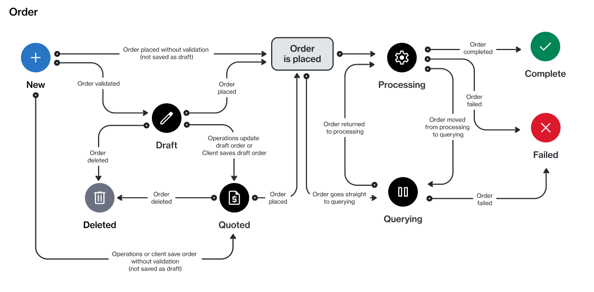

# Order States

An order can have several states from the time it's created in the Marketplace Platform until its completion.&#x20;

The following diagram shows how an order's state can change during its lifecycle:

<figure><figcaption>
Order state transition
</figcaption></figure>

These states are displayed as **Status** on the **Orders** page. They are also displayed on the order details page.&#x20;

Note that the Marketplace Platform supports various account types, including vendor and client, so depending on your account type, only some states might be visible to you.

<table><thead><tr><th width="140">State</th><th>Definition</th></tr></thead><tbody><tr><td><strong>Draft</strong></td><td>The order has been saved as a draft during the ordering process. You can access draft orders through the <strong>Orders</strong> page.</td></tr><tr><td><strong>Processing</strong></td><td>The order has been created, and it's currently awaiting processing by the vendor.</td></tr><tr><td><strong>Querying</strong></td><td>The ordering parameters have been updated by the vendor. The order requires an action to be taken by the client account user.</td></tr><tr><td><strong>Completed</strong></td><td>The order has been processed by the vendor.</td></tr><tr><td><strong>Failed</strong></td><td>The order has been marked as failed by the vendor or SoftwareOne. The reason is displayed on the order details page.</td></tr><tr><td><strong>Deleted</strong></td><td>The draft purchase order has been deleted by the client account user.</td></tr></tbody></table>

## Related topics


[orders.md](../../inventory/orders.md)



[save-order-as-a-draft.md](save-order-as-a-draft.md)



[delete-draft-orders.md](delete-draft-orders.md)



[submit-draft-orders.md](submit-draft-orders.md)



[manage-order-notes.md](manage-order-notes.md)



[set-an-order-to-processing.md](set-an-order-to-processing.md)

