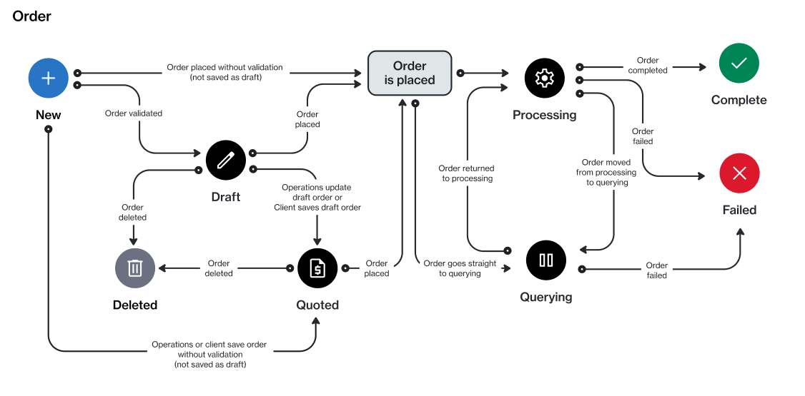

# Order states

An order represents a transaction that starts, changes, or ends a service in Marketplace.

An order can be in one of these states: **Draft**, **Quoted**, **Provisioning**, **Querying**, **Completed**, **Failed**, or **Deleted**. The following diagram shows the transitions between these states:

<figure><figcaption>
The state transition diagram of an order.
</figcaption></figure>

The following table describes the different states:

<table><thead><tr><th width="163">State</th><th>Definition</th></tr></thead><tbody><tr><td><strong>Draft</strong></td><td>The order is a draft. This status applies to orders created by the platform for validation purposes. It doesn't apply to orders saved for later during the ordering process.</td></tr><tr><td><strong>Quoted</strong></td><td>The order has been saved for later using the <strong>Save Order</strong> option during order creation.</td></tr><tr><td><strong>Processing</strong></td><td>The order is created, and it's currently awaiting processing by the vendor.</td></tr><tr><td><strong>Querying</strong></td><td>The ordering parameters are updated by the vendor. The order requires an action to be taken by the client.</td></tr><tr><td><strong>Completed</strong></td><td>The vendor has processed the order.</td></tr><tr><td><strong>Failed</strong></td><td>The order could not be processed. The reason is displayed on the order details page.</td></tr><tr><td><strong>Deleted</strong></td><td>The order was deleted. This status applies to orders that are deleted intentionally and those removed by the platform. For more details, see <a href="../../../help-and-support/faqs/my-draft-or-quoted-order-has-been-deleted.md">My draft or quoted order has been deleted</a>.</td></tr></tbody></table>
