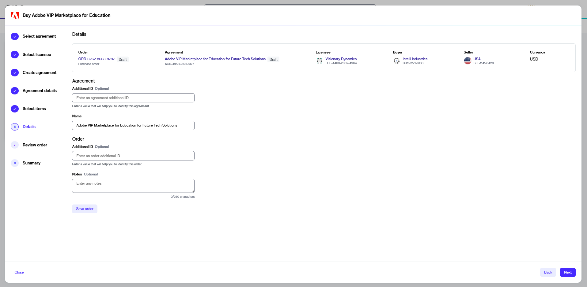

# Save Orders for Later

In the Marketplace Platform, you can save an order and return to it later to complete the ordering process. Saved orders are displayed on the **Orders** page with a **Quoted** status.

## Saving a purchase order

To save your order during the ordering process:

1. Navigate to the **Products** page.
2. Select the product you want to buy.
3. On the product details page, select **Buy now** to start the purchase wizard.
4. In the purchase wizard, complete all the steps until you reach the **Details** page.
5. In the **Details** step, select **Save order**. Your order is saved and assigned a **Quoted** status.

<figure><figcaption>
Save order option in the Details section
</figcaption></figure>

## Saving a change order

A change order represents an order to change subscription quantities. Change orders are placed when you adjust the quantity of your subscription licenses. This includes upsizing as well as downsizing.&#x20;

Change orders can be saved for submitting them later.&#x20;

To save a change order:

1. Navigate to the **Subscriptions** page in the platform.
2. Select the required subscription.
3. On the subscription details page, select **Edit** to start the **Edit subscription** wizard.&#x20;
4. In the **Items** step, adjust the quantity and select **Next**.
5. In the **Details** step, select **Save order**. Your order is saved and assigned a **Quoted** status.&#x20;

<figure><figcaption>
Save order option in the Details section
</figcaption></figure>

## Next steps

When you are ready to finalize the order, open the order details page and select **Review** to continue the ordering process. For details, see [Submit Your Saved Orders](submit-draft-orders.md).
