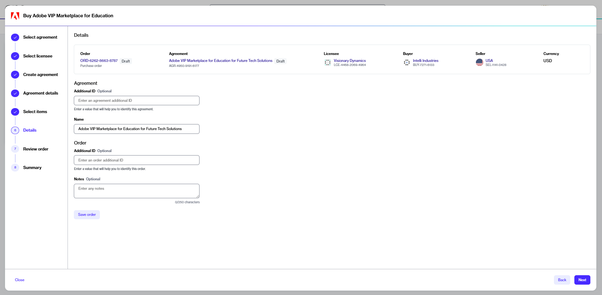

# Save an order for later

In the SoftwareOne Marketplace, you can save an order and return to it later to finalize and submit it. Saved orders are displayed on the **Orders** page with a **Quoted** status.&#x20;

This topic describes how you can save an order for purchasing later.&#x20;

### Saving a purchase order

To save a purchase order for later:

1. On the **Products** page, select the product you want to buy.
2. On the product details page, select **Buy now** to start the ordering process.
3. Complete all the steps until you reach the **Details** step.
4. In the **Details** step, enter details as necessary, then select **Save order**. The order is saved for later.

<figure><figcaption>
The Save Order option in the Details step.
</figcaption></figure>

### Saving a change order

A change order represents an order to change subscription quantities. Change orders are created when you adjust the quantity of your subscription licenses. This includes upsizing as well as downsizing subscriptions.&#x20;

To save a change order for later:

1. Go to **Marketplace** > **Subscriptions**.
2. Select the required subscription. The details page of the subscription opens.
3. Select **Edit** to start the **Edit subscription** wizard.&#x20;
4. In the **Items** step, adjust the quantity as needed and select **Next**.
5. In the **Details** step, enter details as necessary, then select **Save order**. The order is saved for later.

<figure><figcaption>
The Save Order option when submitting a change order.
</figcaption></figure>

## Next steps

When you are ready to finalize the order, select the order on the **Orders** page and select **Review** on the order details page to continue the process. For more information, see [Submit your saved orders](submit-draft-orders.md).
