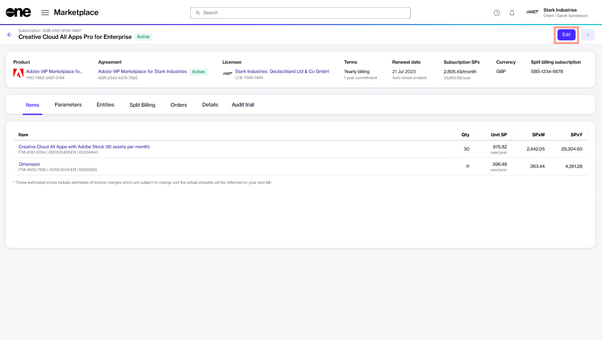

---
layout:
  title:
    visible: true
  description:
    visible: true
  tableOfContents:
    visible: true
  outline:
    visible: true
  pagination:
    visible: true
---

# Save Your Order as a Draft

In the Marketplace Platform, draft orders allow you to save the order configuration when you are creating an order. You can save different types of orders as a draft when creating the order.

Once you save an order as a draft, you can return to it anytime to complete the ordering process. Saved draft orders are displayed on the **Orders** page with a **Draft** status.

## Saving a purchase order as a draft

To save your order as a draft during the ordering process:

1. Go to the **Products** page (**Marketplace** > **Products**) and select the product you wish to buy.
2. On the product details page, click **Buy now**. The ordering process begins.
3. In the purchase wizard, complete the steps as needed until you reach the **Details** section.
4. In the **Details** section, click **Save order** to save the order. Your draft order is saved and you can close the purchase wizard.

<figure><figcaption>
Save order option in the Details section
</figcaption></figure>

## Saving a change order as a draft

A change order represents an order to change subscription quantities. Change orders are placed when you adjust the number of your licenses. This includes ordering more licenses or reducing the number of existing licenses.

When creating a change order for quantity adjustments, you can save the change order as a draft and submit it later. To do this, follow these steps:

1. Open the **Edit subscription** wizard. You can launch the wizard by clicking **Edit** on the subscription details page.

<figure><figcaption>
Details page of a subscription
</figcaption></figure>

2. In the **Edit subscription** wizard, change the license count as needed and click **Next**.
3. In the **Details** section, click **Save order** to save the change order as a draft. Your draft order is saved and you can close the wizard.

<figure><figcaption>
Save order option in the Details section
</figcaption></figure>

## Next steps

When you are ready to finalize the draft order, open the order from the **Orders** page and click **Edit** in the upper right to continue where you left off.

<figure><figcaption>
Edit option on the details page
</figcaption></figure>

You can either save the same order as a draft again or proceed to place the order. Draft orders can be updated and saved as many times as needed.

If a draft order is no longer required, [you can also delete it](delete-draft-orders.md). Once a draft order is placed, it's no longer listed as a draft.

## Related topics


[orders.md](../../inventory/orders.md)



[order-states.md](order-states.md)



[delete-draft-orders.md](delete-draft-orders.md)



[submit-draft-orders.md](submit-draft-orders.md)



[manage-order-notes.md](manage-order-notes.md)



[set-an-order-to-processing.md](set-an-order-to-processing.md)

