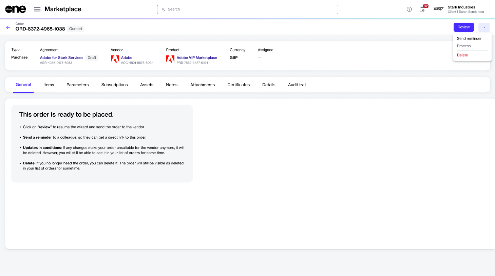

# Send Order Reminder Email

If you have an order in your account that has been created but not placed yet, and you want to remind an individual about this order, you can send them an order reminder email.&#x20;

The **Send reminder** feature triggers an email to remind the individual to take action on the order.

With this feature, you can share the order link with individuals in your account, as well as with those who have accounts on the platform but are not added to your account. Note that reminders can be sent for orders only in the Quoted status.

## Sending an order reminder email

To send an order reminder email:

1. Navigate to the **Orders** page.
2. Select the order ID to open the details page. Make sure the order's status is **Quoted**.
3. On the order details page, select the arrow and choose **Send reminder**.&#x20;

<figure><figcaption>
Send reminder option
</figcaption></figure>

4. In the **Send order to user** wizard, do the following:
   1. In the **Email address** step, enter the email address of the person to whom you want to send the order notification email. Then, select **Next**.
   2. In the **Order details** step, enter the reference information and select **Next**.
   3. In the **Overview** step, select the **Send a copy of this email to me** checkbox if you want to receive a copy of the email. Otherwise, leave it clear.
5. Select **Send**.

## Next steps

The individual will receive an email with a link to the order. After selecting the link, they can review the order and complete the ordering process.&#x20;
