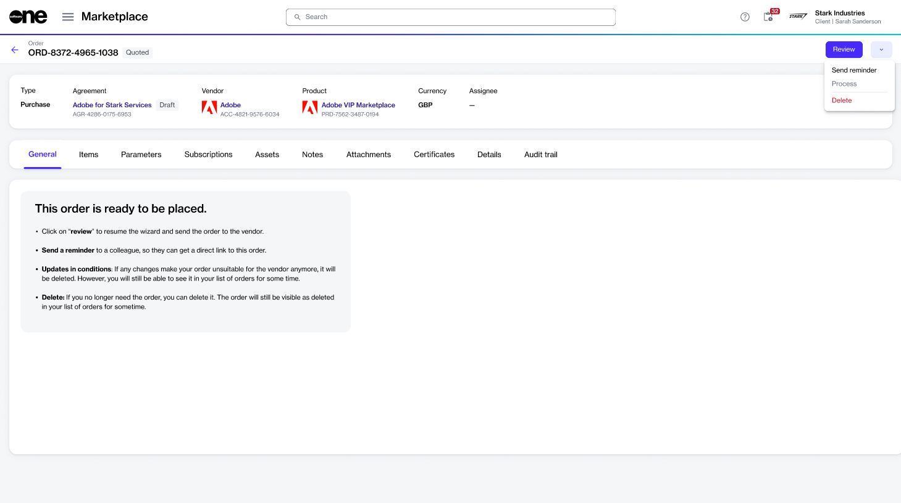

# Send order reminder email

If you have created an order but have not yet submitted it for processing, you can use the **Send Reminder** feature to notify the person responsible for completing the order.

The **Send Reminder** feature sends a reminder email that includes a link to the order, and it also allows you to send a copy of the email to yourself.

Reminders can be sent only for orders in **Quoted** status, which applies to orders saved for later using the **Save Order** option during order creation.

### Send an order reminder email

To send an order reminder email:

1. Go to **Marketplace** > **Orders**.&#x20;
2. Select the required order to open its details page.
3. Select the dropdown arrow , then choose **Send reminder**.&#x20;

<figure><figcaption>
Use <strong>Send reminder</strong> to send a reminder email about the order.
</figcaption></figure>

4. In the **Send order to user** flow, do the following:
   1. **Email address** - Enter the email address of the person to whom you want to send the reminder email, then select **Next**.
   2. **Order details** - Enter reference details as needed, then select **Next**.
   3. **Overview** -  Select the **Send a copy of this email to me** checkbox to receive a copy of the email. Otherwise, leave it clear.
5. Select **Send**. The individual will receive an email containing a link to the order. After selecting the link, they can review the order in the platform and submit it for processing.&#x20;
