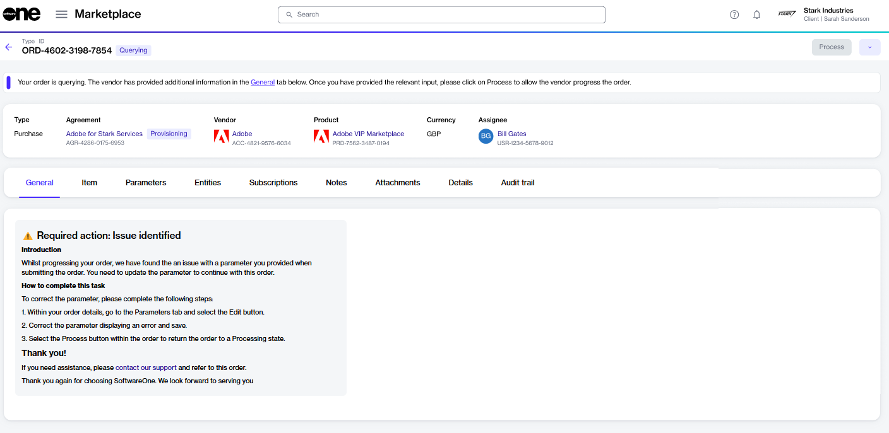

# Change Your Order's Status to Processing

In some cases, you may need to provide additional information if there are errors in the details you submitted when placing your order or if you need to complete specific steps before we can process your order.

When an order requires your attention, its status is displayed as **Querying**. When you open a querying order, the details page shows a message indicating what needs to be corrected and how to fix it.&#x20;

After completing the necessary steps, select **Process** to update the order status to **Processing**. Changing the status informs the vendor that the order is ready for their review.

## Changing your order's status to Processing

To change your order's status from **Querying** to **Processing**:

1. Navigate to the **Orders** page on the platform.
2. Select the purchase order in the **Querying** state. If you have several orders, use the [search bar](../../../marketplace-platform/getting-started/interface/#search) or [filters](../../../marketplace-platform/getting-started/marketplace-for-clients/how-to-filter-your-orders.md) to find the order.
3. On the **General** tab, review the action required message. The following example shows that there's an issue with the parameters, and they must be updated through the **Parameters** tab.

<figure><figcaption>
Querying order
</figcaption></figure>

4. Complete the steps as needed and then select **Process** in the upper right. Note that this button becomes available only after you have completed the necessary steps.&#x20;

Your order's status will change to **Processing,** and the **Process** button will become unavailable again.


If certain issues require completion outside the Marketplace Platform, such as accepting a SoftwareOne relationship request for CSP orders, you must complete the request and then return to the order details page to change the order status to **Processing**.&#x20;

