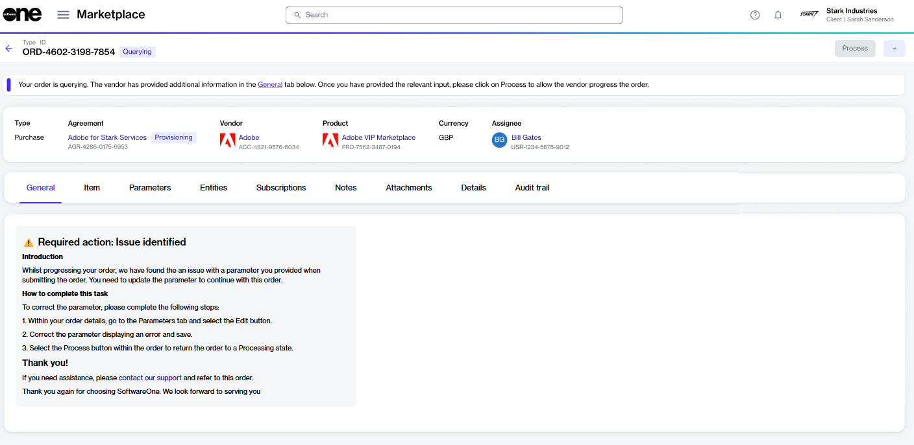

# Change status from Querying to Processing

In some cases, you may need to provide additional information if your order information is incorrect or incomplete, or requires specific steps to be completed before it can be processed.&#x20;

Orders that need your attention appear with a **Querying** status. When you open a querying order, the **General** tab on the details page explains what needs to be corrected and how to resolve the issue.

After completing the required steps, you must update the order status from **Querying to Processing**. Updating the status notifies SoftwareOne and the vendor that the order is ready for their review and further processing.

### Set a querying order to processing

To move an order from **Querying** to **Processing**:

1. Go to **Marketplace** > **Orders**.
2. (Optional) Use the [search bar](../../../marketplace-platform/getting-started/interface/#search) or [filters](../../../marketplace-platform/guides-and-tutorials/marketplace-for-clients/how-to-filter-your-orders.md) to find the required order.&#x20;
3. Select the order to open its details page.
4. On the **General** tab, review the message and take the required action.

<figure><figcaption>
An example of a Querying order in the platform.
</figcaption></figure>

5. Select **Process**. This button becomes available only after you have completed the required action indicated in the message.


If certain issues require completion outside the Marketplace Platform, such as accepting a SoftwareOne relationship request for CSP orders, you must complete the request and return to the order details page to update the order status to **Processing**.&#x20;

