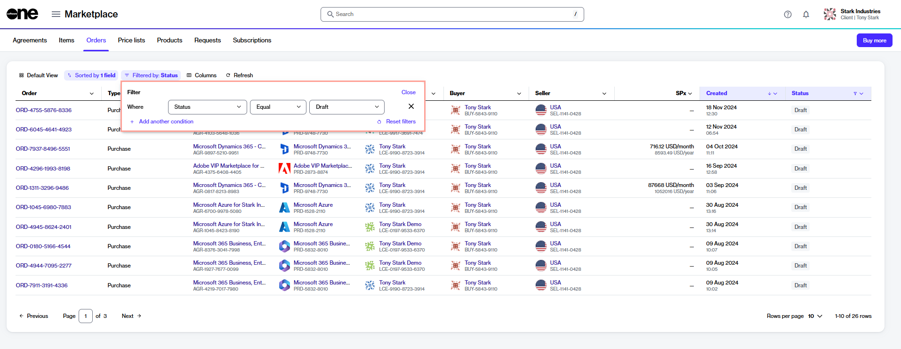
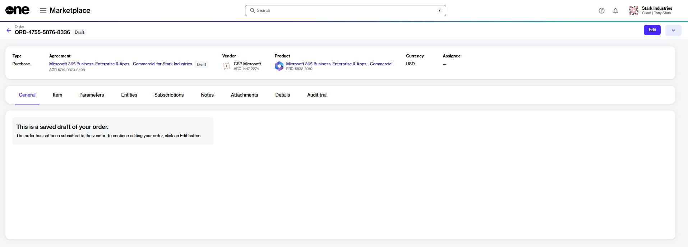

# Submit Saved Draft Orders

If you saved an order for later and want to submit it for processing, you can do this through the **Orders** page in the platform.

After you have submitted the order, it will no longer appear as a saved order with a draft or quoted status.

## Submitting a saved draft order for processing

To submit a saved order for processing:

1. Navigate to the **Orders** page in the platform.
2. (Optional) Use the following filters to find the required order:
   1. Select the  **Filter** option in the grid.
   2. Select **Add another condition** and then use the dropdown to make the following selections:
      1. In the first field, choose **Status**.
      2. In the second field, set the filter to **Equal**.
      3. In the third field, select **Draft** and then close the filter box.

<figure><figcaption>
Filter options
</figcaption></figure>

3. Select the link for the order in the **Order** column.
4. On the order details page, select **Edit** to start the purchase wizard.

<figure><figcaption>
Edit option on the details page
</figcaption></figure>

5. On the **Select Items** page, do one of the following:
   1. If your draft order includes items you may have added before saving it as a draft, those items are displayed in the **Items** section. Verify the item details and select **Next**.
   2. If no items were added, the **Select Items** window opens, allowing you to choose individual items to add to your order. After adding the items, select **Next**.
6. On the **Details** page, enter the additional ID and notes for your order. When done, select **Next**.&#x20;
7. On the **Review order** page, check the details. Then, select **Place order**.

Your draft order is submitted to the vendor for processing. Select **View details** to go to the order details page. Otherwise, select **Close**.&#x20;
