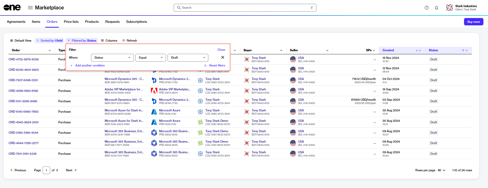
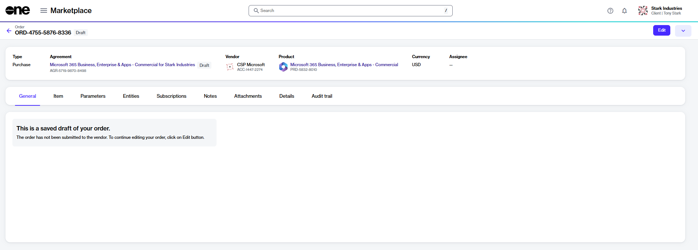

# Submit saved orders

If you [saved an order for later](save-order-as-a-draft.md), you can submit it for processing from the **Orders** page.

Once a saved order is submitted, it is no longer listed as a saved order and will not appear with a draft or quoted status.

### Submit a saved order for processing

To submit a saved order for processing:

1. Go to **Marketplace** > **Orders**.
2. (Optional) Use the following filters to find the required order:
   1. Select the  **Filter** option in the table.
   2. Select **Add another condition** and then use the dropdown to make the following selections:
      1. In the first field, choose **Status**.
      2. In the second field, set the filter to **Equal**.
      3. In the third field, select **Draft** and then close the filter box.

<figure><figcaption>
Use <strong>Filters</strong> to find the required draft order.
</figcaption></figure>

3. Select the required order. Then, on the order details page, select **Edit**.

<figure><figcaption>
Use the Edit option on the order details page to start the order process.
</figcaption></figure>

4. In the **Purchase** flow, complete the following steps:
   1. **Select items** – Do one of the following:
      * If your order already includes items that were added before it was saved for later, those items are displayed in the **Items** section. Review the items, then select **Next**.
      * If no items were added, the **Select items** window opens. Add the items you want to buy, then select **Next**.
   2. **Details** – Provide reference IDs or order notes, then select **Next**.
   3. **Review** – Review the order details, then select **Place order**.
   4. **Summary** – Select **View details** to open the order details page or select **Close**.&#x20;

Once the order is submitted, the order status changes to **Processing**, and the agreement status changes to **Updating**. This means that no other orders can be placed against the agreement.

If the order is successfully processed, the order status changes to **Completed**, and the agreement status changes to **Active**. If the order needs your attention, the status changes to **Querying**. Open the querying order and review the **General** tab for the next steps.
