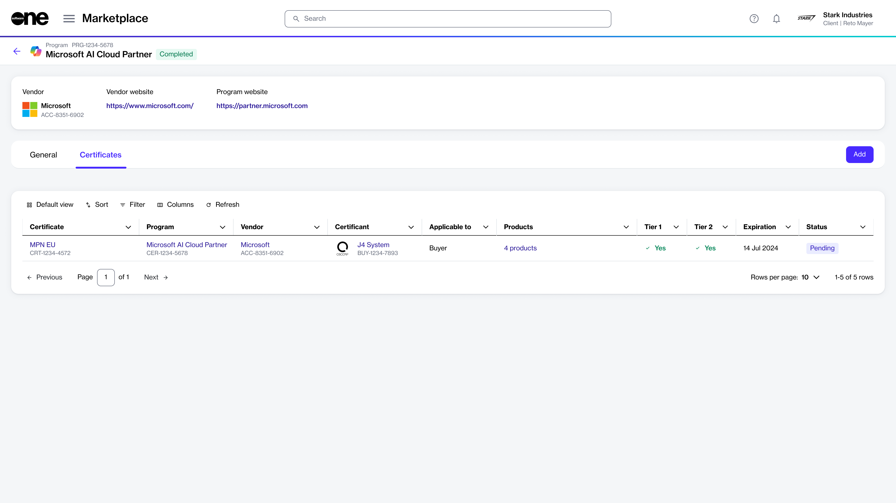

# Programs

The **Programs** page in the platform shows all programs that are active and open for enrollment. By enrolling in a program, eligible partners and clients get access to all benefits associated with the program.&#x20;

Selecting a program on the **Programs** page opens a details page, where you can read more about the program to understand its purpose and requirements.

<figure><figcaption>
Program details page
</figcaption></figure>

On a program's details page, you can add your existing certificate for that program. For instructions, see [Add Existing Certificate](certificates/add-existing-certificate.md). &#x20;

If you wish to enroll in a program you are not currently enrolled in, you can do so by requesting a new certificate for that program. For instructions, see [Create Enrollment Requests](enrollments/create-enrollment-requests.md). When the enrollment is approved, you receive a certificate confirming that you meet the program's requirements and will receive benefits associated with your membership.
