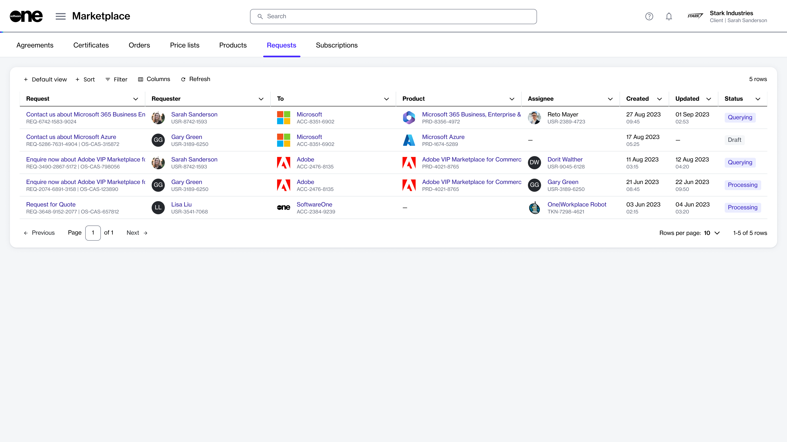
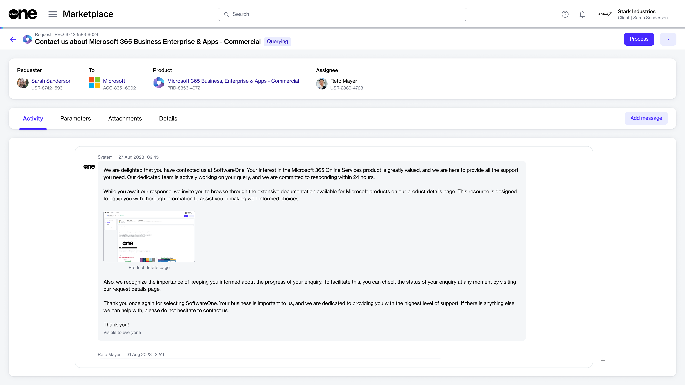

# Requests

A request in the Marketplace Platform represents a pre-sale inquiry. This can include queries about products, subscriptions, pricing, billing, product availability, and more.

Client account users can create new requests through the **Products** page and track existing queries through the **Requests** page. The page displays all requests, including requests that are raised by other members in your account.&#x20;

## Requests interface

To access the **Requests** page from the main menu, select **Marketplace** > **Requests**.

<figure><figcaption>
 Requests page
</figcaption></figure>

The **Requests** page displays a list of your requests. For each request, you can view the following details:

* **Request** - Displays the title of your request.
* **Requester** - Displays the name of the person who created the request.&#x20;
* **To** - Displays the name of the vendor.
* **Product** - Displays the product name for which the request is created.
* **Assignee** - Displays the contact person assigned to the request.
* **Created** -  Displays the date and time when the request was created.
* **Updated** - Displays the date and time when the request was updated.
* **Status** - Displays the status of your request. See [Request States](request-states.md) for information on the possible statuses.

## Request details page

The details page of a request gives you in-depth information about the request. You can open the details page by clicking the request on the **Requests** page.

What can I do on this page?

From the details page, you can complete the following tasks:&#x20;

* [Add a message to the conversation](add-a-message.md)
* [Set your request from Querying to Processing](set-request-to-processing.md)
* [Add and manage the files attached to a request](add-and-manage-attachments.md)

<figure><figcaption>
Details page of a request
</figcaption></figure>

The request details page displays the product against which the request has been raised and the request status. You can also view general information about the request, such as the requester's name, vendor, and assignee.&#x20;

The request details page is organized into several tabs, each providing specific information. The following tabs are available:

* **Activity** - Displays the activity information, including the message history for the request. Clicking  **Add message** allows you to [add a new message](add-a-message.md) to the conversation.&#x20;
* **Parameters** - Displays the request parameters. Parameters are for viewing only and can't be edited.
* **Attachments** - Displays the files attached to the request. You can also [add and manage attachments](add-and-manage-attachments.md).&#x20;
* **Details** - Displays the additional IDs and the timestamps of all changes made to the request.

## Related topics 


[request-states.md](request-states.md)



[create-new-requests.md](create-new-requests.md)



[add-a-message.md](add-a-message.md)



[set-request-to-processing.md](set-request-to-processing.md)



[add-and-manage-attachments.md](add-and-manage-attachments.md)

