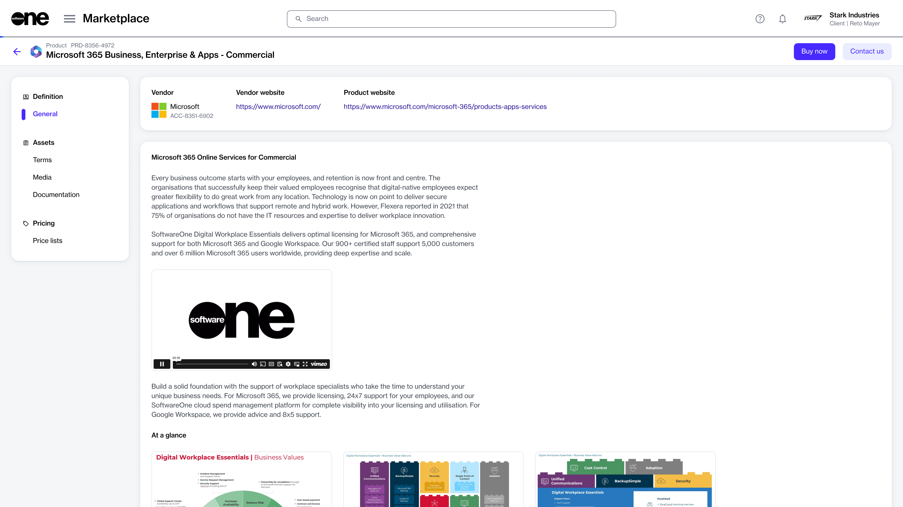

# Create New Requests

If you require personalized assistance or have queries regarding a product, you can contact the vendor or SoftwareOne directly through the marketplace.

You can contact a vendor only if the vendor has enabled the option. If the option is available, you'll see an **Enquire Now,** **Contact Us,** or a similar button on the **Products** page.

## Creating a new request

To create a new request:

1. Navigate to the **Products** page in the platform.
2. Select the product you wish to inquire about.
3. On the product details page, select the option to contact the vendor.&#x20;

<figure><figcaption>
Contact Us option on the details page
</figcaption></figure>

4. On the **Request details** page, provide the details of your request, then select **Next**.

<figure><figcaption>
Request details section
</figcaption></figure>

5. On the **Review Request** page, review the information. When done, select **Submit Request**.&#x20;

<figure><figcaption>
Review request section
</figcaption></figure>

Your request is submitted, and a **Processing** status is assigned to it. Select **View request** to view the request details page. Otherwise, select **Close**.

## Related topics


[.](./)



[request-states.md](request-states.md)



[add-a-message.md](add-a-message.md)



[set-request-to-processing.md](set-request-to-processing.md)



[add-and-manage-attachments.md](add-and-manage-attachments.md)

