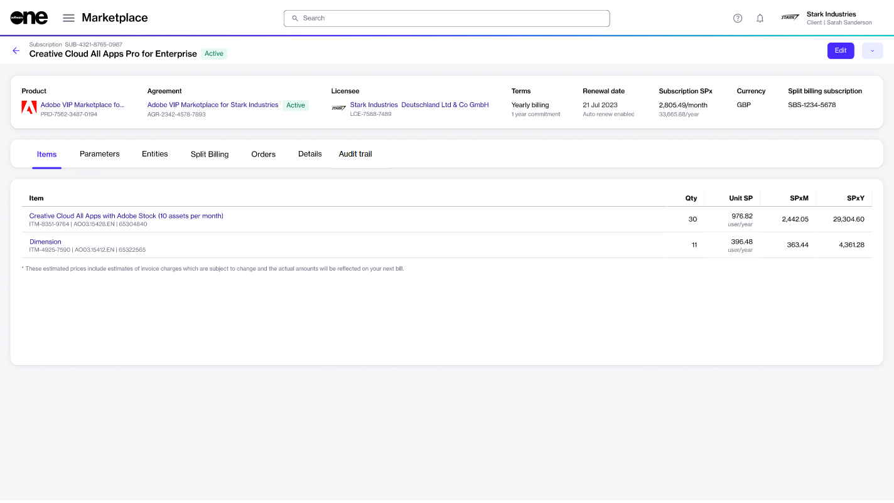

# Subscriptions

A subscription refers to the ongoing service provision under the terms and conditions of an agreement. In the Marketplace Platform, subscriptions are mapped to agreements, and each agreement can contain one or multiple subscriptions.&#x20;

You can [order new subscriptions through the platform](buy-products-and-services.md) and also manage your existing licenses. This includes ordering additional licenses and canceling the previously purchased ones.&#x20;

Your subscriptions are available on the **Subscriptions** page. The page is available under **Marketplace** in the main menu.

<figure><figcaption>
Subscriptions page
</figcaption></figure>

On the **Subscriptions** page, you can view the key properties for each of the subscriptions, including the renewal date and status.

The **Subscriptions** page also contains a **Buy more** option, which gives you quick access to the [Products ](../products.md)page for browsing the catalog and ordering more subscriptions.

## Viewing subscription details 

To view the full details for a subscription, select the subscription name on the **Subscriptions** page.&#x20;

<figure><figcaption>
Subscription details page
</figcaption></figure>

The details page contains general information, such as subscription status, renewal date, commitment timeframe, and more.&#x20;

The page also contains the following tabs that allow you to view and manage the subscription:

<table><thead><tr><th width="170">Tab</th><th>Description</th></tr></thead><tbody><tr><td><strong>Items</strong></td><td>Displays all the items that you ordered along with their details, like the item name, quantity, and pricing.</td></tr><tr><td><strong>Parameters</strong> </td><td>Displays the fulfillment parameters for the subscription. The parameter information varies depending on the parameters enabled by the vendor.</td></tr><tr><td><strong>Entities</strong></td><td>Displays the entities linked to the subscription and their details. Entities include licensees, buyers, and sellers. </td></tr><tr><td><strong>Split billing</strong></td><td>Displays the split billing information, including the buyers and billing allocation. This tab is visible only if split billing has been enabled for the agreement. The <strong>Edit</strong> option allows you to update the buyer allocation. For details, see <a href="../billing/split-billing/edit-split-billing.md">Edit Split Billing</a>.</td></tr><tr><td><strong>Orders</strong></td><td>Displays all orders associated with the agreement along with their status. </td></tr><tr><td><strong>Details</strong> </td><td>Displays additional details, such as references and additional client and vendor IDs, and the timestamps of events. You can also update the client ID using the <strong>Edit</strong> option. For instructions, see <a href="edit-subscription-id.md">Edit Subscription Client ID</a>. </td></tr><tr><td><strong>Audit trail</strong></td><td>Displays all events that have taken place within the subscription. To learn more, see <a href="../../settings/audit-trail.md">Audit Trail</a>.</td></tr></tbody></table>

## Additional actions

You can also perform various actions on the details page. The available actions depend on the status of the subscription:

* [Increase or decrease the number of licenses](../../../marketplace-platform/getting-started/marketplace-for-clients/adjust-subscription-quantity.md)
* [Rename the subscription](rename-a-subscription.md)
* [Terminate the subscription](terminate-a-subscription.md)
* [Edit the subscription's client ID](edit-subscription-id.md)
* [Edit split billing allocation](../billing/split-billing/edit-split-billing.md) (only if split billing is enabled)
* [Manage automatic renewal for a subscription](manage-automatic-renewals.md)
