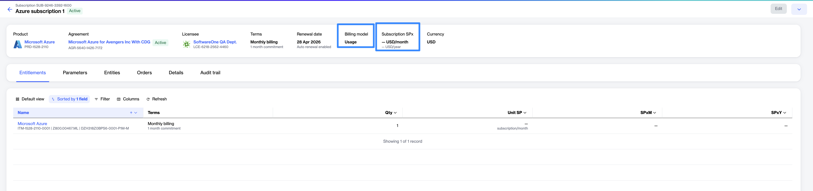
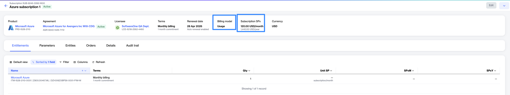
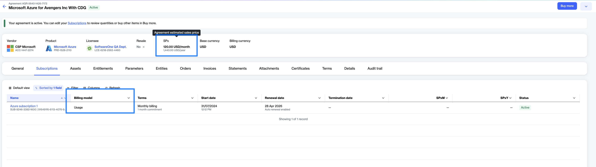

# Subscriptions

A subscription refers to the ongoing service provisioned under the terms and conditions of an agreement. In the SoftwareOne Marketplace, subscriptions are mapped to agreements, and each agreement can contain several subscriptions.&#x20;

You can order and manage subscriptions through self-service in the platform. This includes ordering additional licenses, terminating subscriptions, managing automatic renewal, and more.&#x20;

### Subscription models

The Marketplace supports two subscription models: **quantity-based** and **usage-based**. These models determine how services are billed and how values are displayed in subscriptions and agreements.

* **Quantity-based** - Quantity‑based subscriptions are priced based on an agreed quantity. The values shown in the subscription and agreement represent an estimated total value based on that quantity. Changes to quantity updates, prorations, or billing conditions can affect the final charged amount.&#x20;
* **Usage-based** - Usage‑based subscriptions are billed according to actual consumption. Because usage can vary over time, the total cost of a usage‑based subscription can't be fully calculated in advance. As a result, subscriptions and agreements that include usage‑based services can display no value or an estimated value to indicate expected costs.


All values in your subscriptions and agreements are indicative. The final billed amount is always confirmed in the invoice.


### Estimated values

To ensure transparency, vendors may provide estimated values for usage‑based subscriptions. These values indicate expected costs but don't represent fixed or committed amounts.

* **Estimated subscription value** - Represents an estimate of the expected total cost for the subscription. It's an optional value provided by the vendor and applies to usage‑based subscriptions. The estimated subscription value is for informational purposes only and is not used for billing.&#x20;
* **Estimated agreement value** - Represents an estimated total of all subscriptions within the agreement. For more information on the estimated agreement value, see [Agreements](../agreements/).

Estimated values, when available, are displayed on both agreements and agreement details pages, as well as subscriptions and subscription details pages. If a value is unavailable, the corresponding field displays an em dash “—”.

Example: Estimated values for usage-based subscriptions

The following image shows a usage-based subscription where the estimated value is not provided:

<figure><figcaption>
The em dash (“—”) indicates no estimated value is provided.
</figcaption></figure>

The following image shows a usage-based subscription where the estimated value is provided:

<figure><figcaption>
When the vendor provides an estimated value, it appears under Subscription SPx.
</figcaption></figure>

Example: Estimated agreement value with usage-based subscriptions

The following image shows an agreement containing usage-based subscriptions and the agreement's estimated value.

<figure><figcaption>
The estimated value appears under SPx (agreement estimated sales price).
</figcaption></figure>

### Accessing subscriptions

The **Subscriptions** page displays all subscriptions in your account.&#x20;

To navigate to the **Subscription** page, select the main menu, then choose **Marketplace** > **Subscriptions**. The list of subscriptions is displayed.

From this page, you can select a subscription to see details, including entitlements it contains, estimated values, and other data.

<figure><figcaption>
Use the Subscriptions page to view and manage subscriptions. 
</figcaption></figure>

On the **subscriptions** page, you can view various details for a subscription, including the subscription ID, linked entities (such as buyers and sellers), the estimated subscription value, status, and more.&#x20;

You can also select a subscription to view detailed information organized across several tabs. The information available includes your entitlements, orders, a record of events or logs for the subscription, and more. For details, see [View subscriptions](view-subscriptions.md).

### Related topics


[subscription-states.md](subscription-states.md)



[view-subscriptions.md](view-subscriptions.md)



[rename-a-subscription.md](rename-a-subscription.md)



[edit-subscription-id.md](edit-subscription-id.md)



[terminate-a-subscription.md](terminate-a-subscription.md)



[manage-automatic-renewals.md](manage-automatic-renewals.md)

