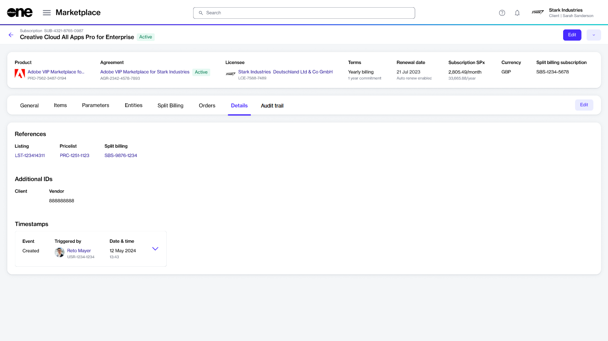
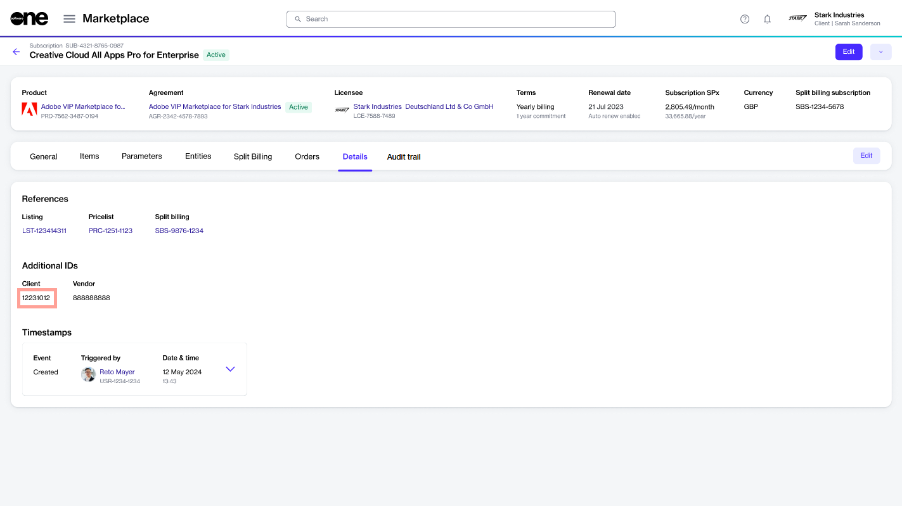

# Edit Subscription Client ID

If you want to assign a client ID to a subscription, you can do this from the subscription's details page.&#x20;

Client IDs can only be added or updated for the subscriptions in the **Active**, **Updating**, **Terminated**, and **Terminating** states. For a description of these states, see [Subscription States](subscription-states.md).

## Editing a subscription's client ID

To update a subscription's client ID:

1. Navigate to the **Subscriptions** page.
2. Select the subscription you want to update.
3. On the subscription details page, select the **Details** tab. Then, select **Edit**.&#x20;

<figure><figcaption>
Details tab of a subscription
</figcaption></figure>

4. In the **Edit ID** dialog, enter the new ID in the **Additional ID** field.&#x20;
5. Select **Save**. The ID is updated and displayed as Client ID under **Additional IDs**.&#x20;

<figure><figcaption>
Updated subscription ID on the Details tab
</figcaption></figure>

