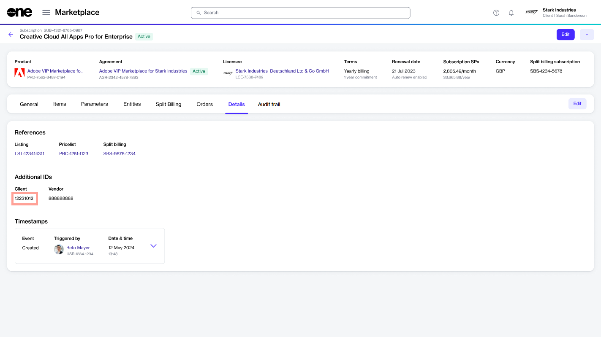

# Edit Subscription ID

The Marketplace Platform automatically assigns a default ID to each subscription when it's created. You can modify the default ID and assign a new ID of your choice.

IDs can only be changed for the **Active**, **Updating**, **Terminated**, and **Terminating** subscriptions. For a description of these states, see [Subscription States](subscription-states.md).

## Editing a subscription's ID

Follow these steps to update a subscription's ID:

1. On the **Subscriptions** page (**Marketplace** > **Subscriptions**), click the subscription you want to update. The subscription details page opens.
2. Select the **Details** tab and then click **Edit**.&#x20;

<figure><figcaption>
Details tab of a subscription
</figcaption></figure>

3. In the **Edit ID** dialog, enter the new subscription ID in the **Additional ID** field.&#x20;
4. Click **Save**. The ID is updated and displayed as Client ID under **Additional IDs**.&#x20;

<figure><figcaption>
Updated subscription ID on the Details tab
</figcaption></figure>

## Related topics


[Subscriptions](https://app.gitbook.com/s/rouC21YfVpuUxysQFTrr/modules-and-features/marketplace/subscriptions)



[Subscription States](https://app.gitbook.com/s/rouC21YfVpuUxysQFTrr/modules-and-features/marketplace/subscriptions/subscription-states)



[Edit Subscription Name](https://app.gitbook.com/s/rouC21YfVpuUxysQFTrr/modules-and-features/marketplace/subscriptions/rename-a-subscription)



[Terminate Subscription](https://app.gitbook.com/s/rouC21YfVpuUxysQFTrr/modules-and-features/marketplace/subscriptions/terminate-a-subscription)

