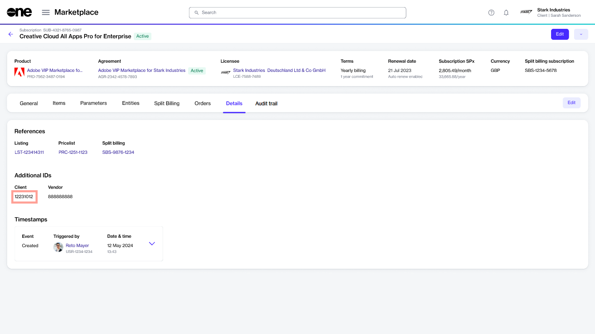

# Assign client ID to a subscription

A subscription client ID is a unique, optional identifier that you can assign to a subscription.

This allows you to reference the subscription using a meaningful ID within your business systems, such as your CRM or ERP, instead of using only the auto-generated Marketplace subscription ID.

You can assign a new client ID or update the existing ID from the subscription details page. IDs can only be added or updated for active, updating, terminated, or terminating subscriptions.&#x20;

### Assign a client ID to a subscription

To assign a client ID to a subscription:

1. Go to **Marketplace** > **Subscriptions**.
2. Select the required subscription.
3. On the subscription details page, select the **Details** tab.&#x20;
4. Select **Edit**.&#x20;
5. In the **Edit ID** dialog, enter the ID, then select **Save**. The updated ID is displayed under **Additional IDs**.

<figure><figcaption>
The Client Additional ID is displayed on the Details tab.
</figcaption></figure>

