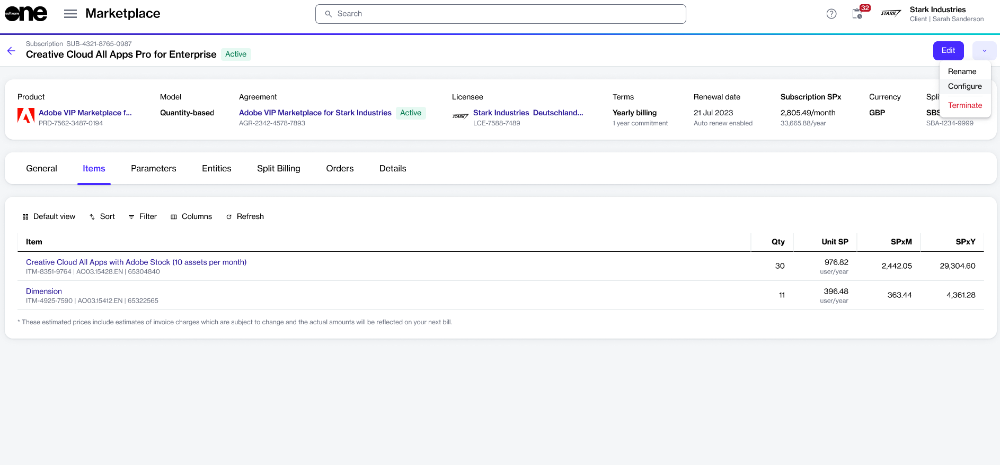

# Manage Automatic Renewals

In the Marketplace Platform, we automatically renew subscriptions for your convenience and to prevent any service interruptions.&#x20;

If you don't want your subscription to renew automatically, you can disable auto-renewal if it's supported for your specific product. By doing so, your subscription will expire at the end of the commitment period or renewal date, and you will not be billed after that.&#x20;

In cases where you previously disabled auto-renewal for a subscription but want to re-enable it, you can do so before the subscription expires.

Disabling or enabling automatic renewal can be done by placing a configuration order.&#x20;

## Disabling or enabling automatic renewal 

Before disabling or enabling automatic renewal, make sure that both the agreement and subscription are active.&#x20;

To manage automatic renewal:

1. Navigate to the **Subscriptions** page and select the relevant subscription.
2. On the subscription details page, select the arrow and choose **Configure** to start the configuration order wizard.&#x20;

<figure><figcaption>
Configure option on the subscription details page
</figcaption></figure>

3. In the **Auto renewal** step, choose the required auto-renewal status, and select **Next**.&#x20;
4. In the **Order details** step, provide a reference ID for the configuration order and enter notes for your order as necessary. Then, select **Next**.
5. Review the details. When done, select **Place order**.&#x20;

The configuration order is placed, and the order summary is displayed. Select **View order** to go to the order details page. Otherwise, select **Close** to exit the wizard.

When the configuration order has been placed, your agreement's status changes from **Active** to **Updating**. After your order has been completed, the agreement's status changes back to **Active**, and the new auto-renewal status is reflected on the subscription's details page.
