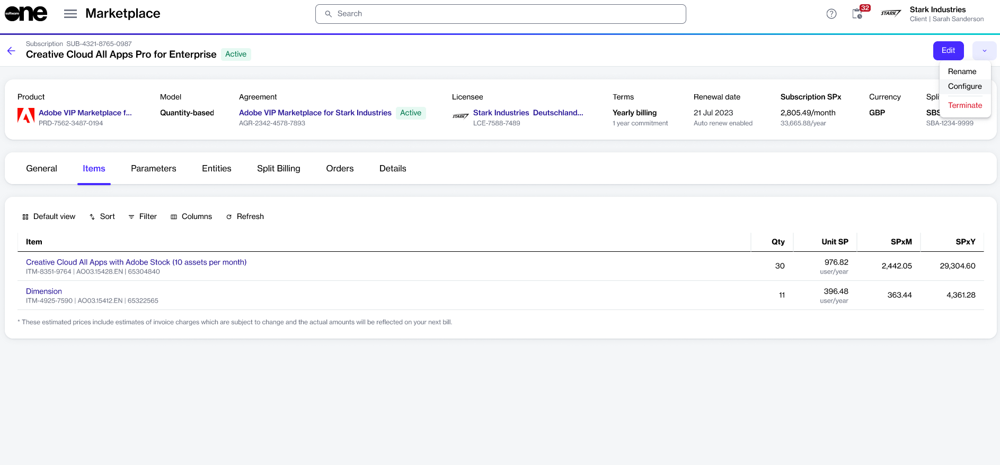

# Manage automatic renewal

In the SoftwareOne Marketplace, we automatically renew subscriptions for your convenience and to prevent any service interruptions.&#x20;

If you don't want your subscription to renew automatically, you can disable auto-renewal if it's supported for your specific product. By doing so, your subscription will expire at the end of the commitment period or renewal date, and you won't be billed after that. Additionally, if you previously disabled auto-renewal for a subscription and now want to re-enable it, you can do this before the subscription expires.

### Disabling or enabling automatic renewal 

Auto-renewal settings can be managed by placing a configuration order.  Before changing the setting, make sure that both the agreement and subscription are active.&#x20;

To manage renewal:

1. Go to **Marketplace** > **Subscriptions.**
2. Select the subscription you want to manage.
3. On the **subscription details** page, select the arrow , then choose **Configure.**

<figure><figcaption>
The Configure option on the subscription details page.
</figcaption></figure>

4. In the **Configuration order** wizard, do the following:
   1. **Auto-renewal** - Choose the required auto-renewal status, then select **Next**.&#x20;
   2. **Order details** - Enter the additional ID and notes for the order. Then, select **Next**.
   3. **Review order** - Review the details. When done, select **Place order** to submit your order.&#x20;
   4. **Summary** - Select **View order** to open the order details page. Otherwise, select **Close**.

Once your configuration order is submitted, the agreement status changes from **Active** to **Updating**. When the order completes, the status changes back to **Active**, and the new auto-renewal status is reflected on the subscription details page.
