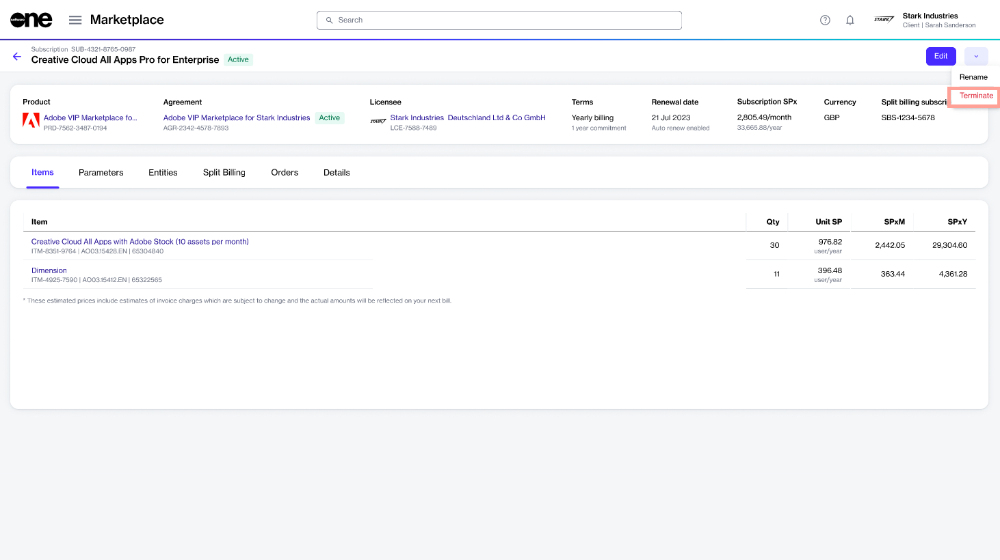

# Terminate subscription

You can terminate a subscription if you no longer need it or don't want it to renew.&#x20;

Subscriptions are linked to agreements; therefore, the termination process depends on the number of active subscriptions in the agreement.

* If an agreement contains several active subscriptions and you want to cancel some, but not all of them, you must place a termination order for the specific subscription. For details, see [Terminating a subscription](terminate-a-subscription.md#terminate-subscription).
* If the agreement contains several subscriptions and you want to cancel all subscriptions, you must terminate the entire agreement. You can do this by placing a termination order. For details, see [Terminate an agreement](../agreements/terminate-agreements.md).&#x20;

### Before you begin

Before terminating your subscriptions, note the following points:

* You can terminate your active subscriptions. Subscriptions in [any other state](subscription-states.md) can't be terminated.
* Creating a termination order doesn't guarantee cancellation. Termination orders are sent to vendors for approval.

### Terminating a subscription

To terminate a subscription:

1. Go to **Marketplace** > **Subscriptions**.
2. Select the subscription you want to terminate.
3. On the **subscription details** page, select the arrow , then choose **Terminate**.

<figure><figcaption>
The Terminate option on the details page.
</figcaption></figure>

4. In the **Terminate subscription** wizard, do the following:
   1. **Items** - Check that the item quantity is zero, then select **Next**.&#x20;
   2. **Order details** - Provide any reference details and order notes. Then, select **Next**.
   3. **Review order** - Review the order details. When done, select **Place order** to submit your order.
   4. **Summary** - Select **View order** to open the order details page. Otherwise, select **Close**.
