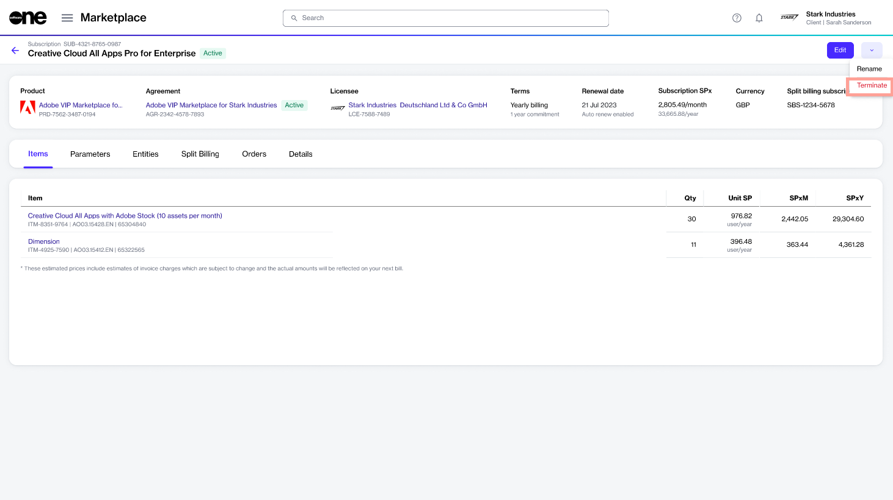

# Terminate Subscription

Subscriptions can be terminated if you no longer need them or you don't want to renew it.&#x20;

As subscriptions are linked to agreements, the process for canceling your subscription varies depending on the number of active subscriptions in the agreement.

* If your agreement contains several active subscriptions and you wish to cancel some, but not all, subscriptions in that agreement, you must place a termination order for the required subscription. The [Terminate subscription](terminate-a-subscription.md#terminate-subscription) section describes the steps.
* If your agreement contains several subscriptions and you want to cancel all subscriptions, you must terminate the agreement altogether. You can do this by placing a termination order for the agreement. For instructions, see [Terminate Agreement](../agreements/terminate-agreements.md).&#x20;

Before terminating subscriptions, note the following points:

* You can only terminate subscriptions in the **Active** state. Subscriptions in [any other state](subscription-states.md) cannot be terminated.
* Creating a termination order through the platform doesn't guarantee the cancellation of your subscription. All termination orders are sent to the vendors for approval. Subscriptions are terminated only after they are approved by the vendor.

## Terminating a subscription

To terminate an active subscription:

1. On the **Subscriptions** page (**Marketplace** > **Subscriptions**), click the subscription to terminate. The details page of your selected subscription opens.
2. Click the down arrow in the upper right and select **Terminate**. The **Terminate Subscription** wizard opens.

<figure><figcaption>
Terminate option on the details page
</figcaption></figure>

3. In the **Terminate Subscription** wizard, do the following:&#x20;
   1. In the **Items** ste&#x70;**,** review the item quantities and click **Next**. The license quantity will be displayed as zero.
   2. In the **Order details** step, enter the reference details and your order notes, and click **Next** to continue.
   3. In the **Review order** step, click **Place order**. The subscription termination order is placed and the agreement status changes from **Active** to **Updating**. &#x20;
   4. Click **View order** to go to the order details page. Otherwise, click **Close** to close the page.

## Related topics


[Subscriptions](https://app.gitbook.com/s/rouC21YfVpuUxysQFTrr/modules-and-features/marketplace/subscriptions)



[Subscription States](https://app.gitbook.com/s/rouC21YfVpuUxysQFTrr/modules-and-features/marketplace/subscriptions/subscription-states)



[Edit Subscription Name](https://app.gitbook.com/s/rouC21YfVpuUxysQFTrr/modules-and-features/marketplace/subscriptions/rename-a-subscription)



[Edit Subscription ID](https://app.gitbook.com/s/rouC21YfVpuUxysQFTrr/modules-and-features/marketplace/subscriptions/edit-subscription-id)

