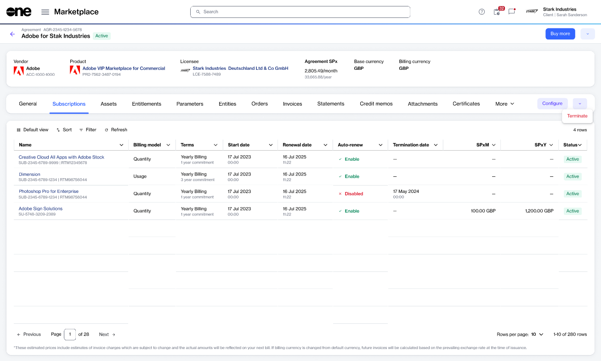

# Terminate multiple subscriptions

You can terminate multiple subscriptions under the same agreement through a single termination order.

Instead of submitting separate termination requests for each subscription, you can include multiple subscriptions in one request.

#### Before you begin

* Only **Active** and **Suspended** subscriptions can be included in a termination request.
* If you select all subscriptions within an agreement, Marketplace displays a warning that the agreement will also be terminated when the order is completed.

### Terminate multiple subscriptions

To terminate multiple subscriptions:

1. Go to **Marketplace** > **Agreements**.
2. Select the required agreement.
3. On the agreement details page, select the **Subscriptions** tab.
4. From the actions menu, select **Terminate**.

<figure><figcaption>
Select <strong>Terminate</strong> from the agreement actions menu to termination multiple subscriptions.
</figcaption></figure>

5. In the guided **Terminate subscription** flow, do the following:
   1. **Subscriptions** – Select the subscriptions you want to terminate.
   2. **Items** – Review the consolidated list of entitlements for the selected subscriptions.
   3. **Details** – Enter a reference ID and order notes, then select **Next**.
   4. **Review order** – Review the order details and select **Place order**.
   5. **Summary** – Select **View order** to open the order details page or select **Close**.

The termination order is sent to the vendor for processing. The selected subscriptions are terminated only after the vendor completes the request.
