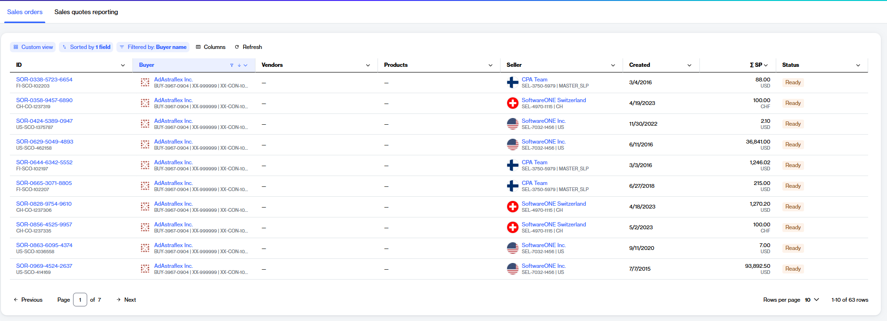

# Sales Orders

The Marketplace Platform offers an enhanced, transparent method for managing your sales orders directly within the platform. A sales order is created after you have accepted a [sales quote](../sales-quotes-reporting/), initiating the order fulfillment and billing process.&#x20;

### Accessing sales orders

The **Sales orders** page provides a consolidated view of your organization's purchasing activities.

To navigate to the **Sales orders** page, select the main menu, then choose **Procurement** > **Sales orders**. A list of your sales orders is displayed, as shown in the following image:

<figure><figcaption>
The Sales Orders page displaying a list of orders and their details.
</figcaption></figure>

On the **sales orders** page, you can view various details for each sales order, including the order ID, creation date, estimated sales price, current status, and more. If you are familiar with our legacy systems, you can conveniently **switch to classic view** to see the details using our legacy interface.&#x20;

You can also select a sales order to view detailed information organized across several tabs. The information available includes:

* Line item details, such as quantities, unit prices, and tax calculations.
* Addresses for **Sell To**, **Ship To**, **Bill To**, and **License To**.
* Details about the software publisher.
* A brief description and reference links for the specific items ordered.
* An **Attachments** tab for official sales order PDFs.
* The **Details** tab, which shows backend system information and synchronization status.

### Related topics


[view-sales-orders.md](view-sales-orders.md)



[download-sales-order-pdf.md](download-sales-order-pdf.md)

