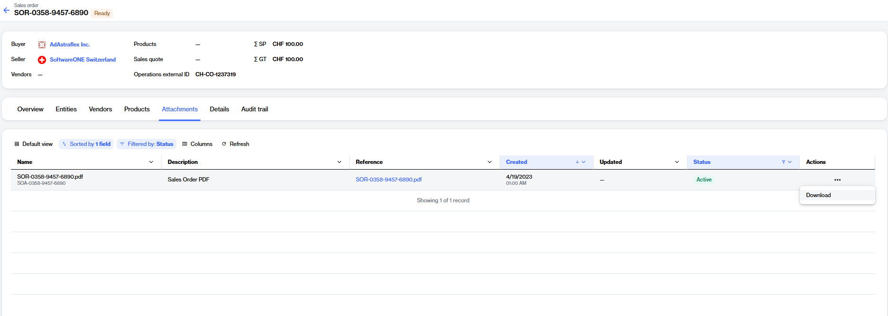

# Download sales order PDF

You can download a PDF version of your sales order from the sales order details page.&#x20;

### Downloading a sales order as a PDF

To download your sales order as a PDF:

1. Go to **Procurement** > **Sales orders**.&#x20;
2. (Optional) Use filters to find the desired sales order.
3. Select the order ID. The details page of the sales order opens.
4. Select the **Attachments** tab.

<figure><figcaption>
Use the Attachments tab to download the sales order PDF.
</figcaption></figure>

5. Complete one of the following steps to download the PDF:
   * Select the PDF link in the **Reference** column.
   * Under **Actions**, select the more icon (**•••**), then choose **Download**.&#x20;
