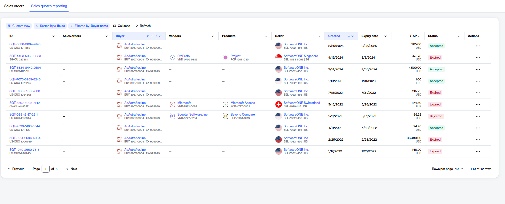

# Sales Quotes Reporting

The **Sales Quotes** module provides you with real-time visibility, streamlined approval workflows, and integration with our backend financial systems.&#x20;

Each sales quote includes important details, including status and expiration date, to help you make informed decisions about your purchase.

### Accessing sales quotes

The **Sales quotes** page is your centralized hub for monitoring all pending, accepted, and historical quotes.&#x20;

To navigate to the **Sales quotes** page, select the main menu, then choose **Procurement** > **Sales quotes reporting**. A list of your sales quotes is displayed, as shown in the following image:

<figure><figcaption>
The Sales Quotes page showing real time statuses along with expiration dates and total values.
</figcaption></figure>

On the **sales quotes reporting** page, you can view various details for each sales quote, including the quote ID, creation and expiration dates, estimated sales price, and more. You can also view the real-time status for each quote. When a quote is marked as **Accepted**, the platform works asynchronously in the background to generate the corresponding [sales order](../../inventory/orders.md).&#x20;

If you are familiar with our legacy systems, you can conveniently **switch to classic view** to see the details using our legacy interface.&#x20;

You can also select a quote to view detailed information. The information available includes:

* Financial and itemized details of the offer.&#x20;
* Corporate entities and addresses linked to the quote.
* Details about the software publisher.
* A brief description and reference links for the specific items in the quote.
* An **Attachments** tab for the official sales quote PDF.
* The **Details** tab, which shows backend system information and synchronization status.

### Related topics


[view-sales-quotes.md](view-sales-quotes.md)



[download-sales-quote-pdf.md](download-sales-quote-pdf.md)

