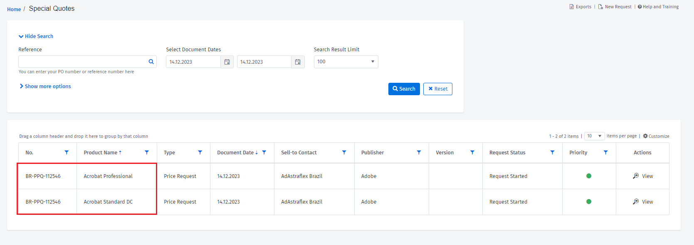
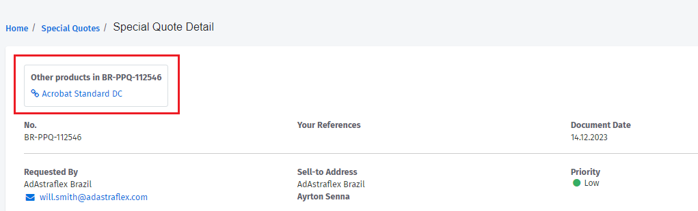

# Request Pricing for Non-Catalog Products

Using Special Quotes, you can request pricing for products that are not listed in your catalog.

You can access the Special Quotes module by navigating to **Procurement** > **Special Quotes**. Alternatively, you can access special quotes from the **Procurement Workbench** and **Products** pages.

Accessing Special Quotes from Procurement Workbench

1. From the main menu, navigate to **Procurement** and select **Procurement Workbench**.&#x20;
2. Select the **Open Product Requests** tab from the Procurement Workbench page and then select **Request Special Quote**.

Accessing Special Quotes from Products page

1. From the main menu, navigate to **Procurement** and select **Products**.
2. Under **Can we help you?**, select **Request Special Quote From Our Team**.

## Creating special quotes 

Watch the following video tutorial or continue reading for information on how to create a special quote:



To create a special quote:

1. Navigate to the **Special Quote** page using any of the methods described at the start of this topic.
2. Under **Location**, choose the SoftwareOne entity that you are ordering from, the country where the product will be used, and your company's address.
3. Under **Products**, do the following:
   1. Choose the publisher from the list and provide the publisher's website. If the publisher is unavailable, enter the publisher's name manually.
   2. Add an internal reference number for your quote.&#x20;
   3. Provide your email address.
   4. Choose a currency from the list.
   5. Select the **Renewal** check box if your special quote request is for product renewal. Clear the checkbox if you're requesting a new product.
4. Provide details of the product. Note that this section is displayed only after you choose the publisher.

<figure><figcaption></figcaption></figure>

5. Under **Request Instructions**, do the following:
   1. Select a priority level for your request.&#x20;
   2. Use special instructions to specify additional details about your request.
   3. Upload supporting documentation.
6. Select **Submit**. Your special quote is created, and a confirmation message is displayed.
7. Select **Yes** to receive a quote confirmation via email, or select **No** to return to the Special Quotes page.

## Viewing special quotes

On the Special Quotes page, you can search for a quote and view high-level information, such as your quote history, request status, type, and more.&#x20;

To view the detailed quote information:

1. Locate the quote you wish to view.
2. Select **View** from the **Actions** column. The quote details are displayed on the Special Quote Detail page.

Note that if your special quote contains multiple products, each product request is displayed in a separate row on the Special Quotes page. For example, if your special quote is for Acrobat Professional and Acrobat Standard, both products are displayed separately on the Special Quotes page, even though they are a part of the same request.&#x20;

<figure><figcaption></figcaption></figure>

When looking at the details of a special quote, products that are part of the same request are displayed under **Other products**.

<figure><figcaption></figcaption></figure>

## Deleting special quotes

If you want to delete a special quote containing multiple products, you can delete it from any of the products.

To delete a special quote:

1. Navigate to the Special Quotes page and locate the quote you want to delete.
2. Select the quote, or from the **Actions** column, select **View**. The Special Quote Detail page is displayed.
3. Select **Delete** and then confirm that you want to delete the quote. The quote is deleted and a confirmation message is displayed.&#x20;
