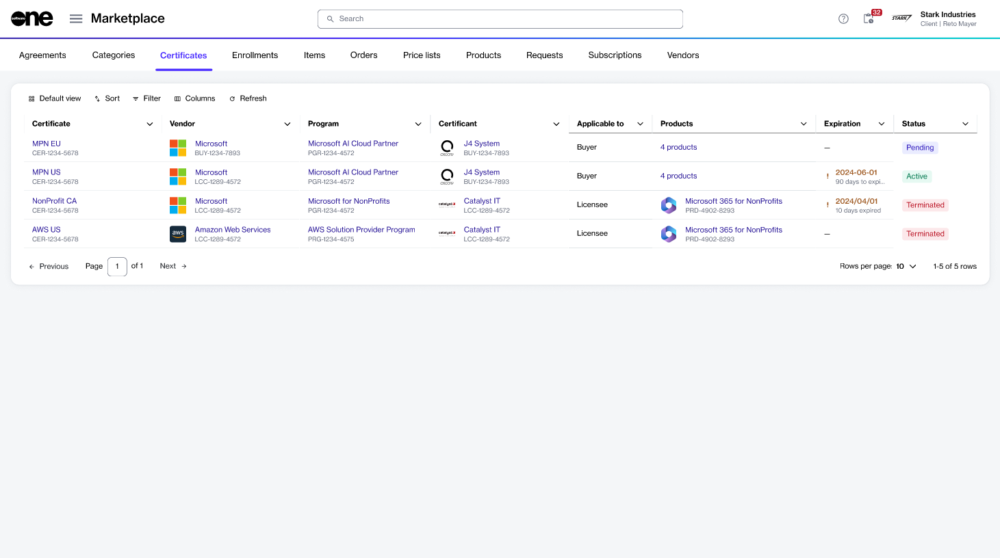

# Certificates

In the Marketplace Platform, a certificate is an object that verifies a client or partner meets a vendor’s requirements and eligibility criteria for a specific program.&#x20;

It serves as official confirmation that the client or partner has complied with the vendor’s standards and is authorized to purchase or access the program’s products. Holding a certificate grants eligibility to purchase products and access all associated benefits and incentives offered by the program.

### Accessing certificates

The **Certificates** page allows you to view your certificates.

To access this page, select the main menu, then choose **Programs** > **Certificates**. Your list of certificates is displayed. This includes certificates awaiting vendor approval, as well as active, expired, and terminated certificates.&#x20;

<figure><figcaption>
The Certificates page in the platform.
</figcaption></figure>

On the **Certificates** page, you can view details, such as the certificate name and ID, name of the certificant, current status, and more.

You can also select a certificate to view detailed information organized across several tabs. The information available includes:

* Current status of the certificate and actions you can take, if any.
* Parameters linked to the certificate.
* Enrollments and agreements related to the certificate.&#x20;
* Terms and conditions of the program.
* Additional IDs, timestamps, and audit trail.

### Related topics


[certificate-states.md](certificate-states.md)



[view-certificates.md](view-certificates.md)



[rename-certificate.md](rename-certificate.md)

