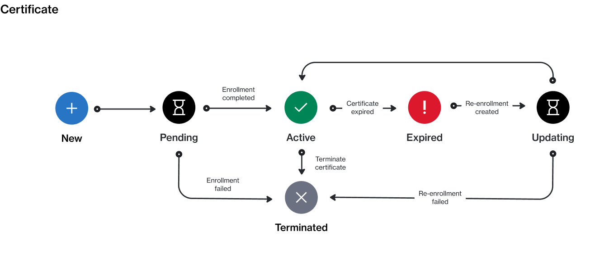

# Certificate status

A certificate is an object that verifies a client or partner meets a vendor’s requirements and eligibility criteria for a specific program.&#x20;

A certificate can currently exist in these states: **Pending**, **Active**, **Expired**, **Updating**, or **Terminated**. The following diagram shows the transitions between these states:

<figure><figcaption>
The state transition diagram of a certificate.
</figcaption></figure>

The following table provides a description of the different states:

<table data-full-width="false"><thead><tr><th width="152">State</th><th>Definition</th></tr></thead><tbody><tr><td><strong>New</strong></td><td>This is the initial or starting state. This state is assigned by the platform when the certificate request is created.</td></tr><tr><td><strong>Pending</strong></td><td>The certificate has been created, and it's awaiting approval by the vendor.</td></tr><tr><td><strong>Active</strong></td><td>The certificate is active.</td></tr><tr><td><strong>Expired</strong></td><td>The certificate has expired. You can renew an expired certificate by <a href="../enrollments/renew-your-enrollment.md">re-enrolling in the program</a>.</td></tr><tr><td><strong>Updating</strong></td><td>The certificate is being updated due to re-enrollment in the program.</td></tr><tr><td><strong>Terminated</strong></td><td>The certificate has been terminated. Terminated certificates can't be used to re-enroll in a program. </td></tr></tbody></table>
