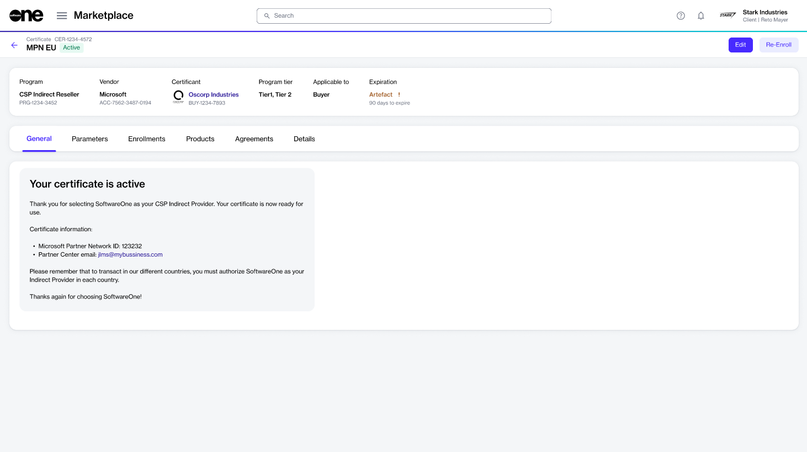

# View certificates

This topic describes how to view a list of certificates in your account, as well as details about a specific certificate.

### View certificates list&#x20;

To view your certificates:&#x20;

1. Go to **Program** > **Certificates**.
2. View the list of certificates displayed on the page.

<figure><figcaption>
Use the Certificates page to view and manage certificates.
</figcaption></figure>

### Open certificate details 

On the certificate details page, you can view extended information for a certificate. Some information is read-only, while others include links that allow you to navigate to further details.

To view the certificate details:

1. Go to **Program** > **Certificates**.
2. Select the certificate you want to view. The certificate details page opens.

<figure><figcaption>
Use the certificate details page to manage a certificate.
</figcaption></figure>

3. Use the tabs to view additional information:

<table><thead><tr><th width="130">Tab</th><th>Description</th></tr></thead><tbody><tr><td><strong>General</strong></td><td>Shows the most up-to-date information for the certificate. For example, if your certificate has been activated, a message is displayed stating that your certificate is ready for use.</td></tr><tr><td><strong>Parameters</strong></td><td>Shows the ordering and fulfillment parameters for the certificate.</td></tr><tr><td><strong>Enrollments</strong></td><td>Shows the enrollment associated with the certificate.</td></tr><tr><td><strong>Terms</strong></td><td>Shows the terms and conditions of the program.</td></tr><tr><td><strong>Details</strong></td><td>Shows additional details associated with the certificate, such as timestamps and additional IDs, if available.</td></tr><tr><td><strong>Audit trail</strong></td><td>Shows the audit trail for the certificate.</td></tr></tbody></table>
