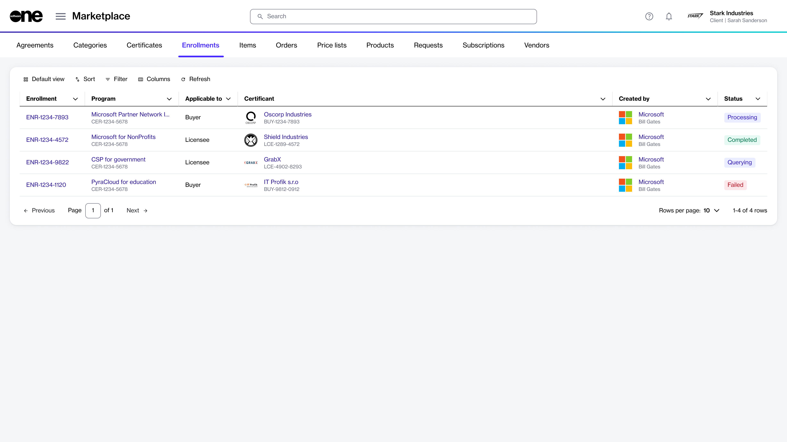
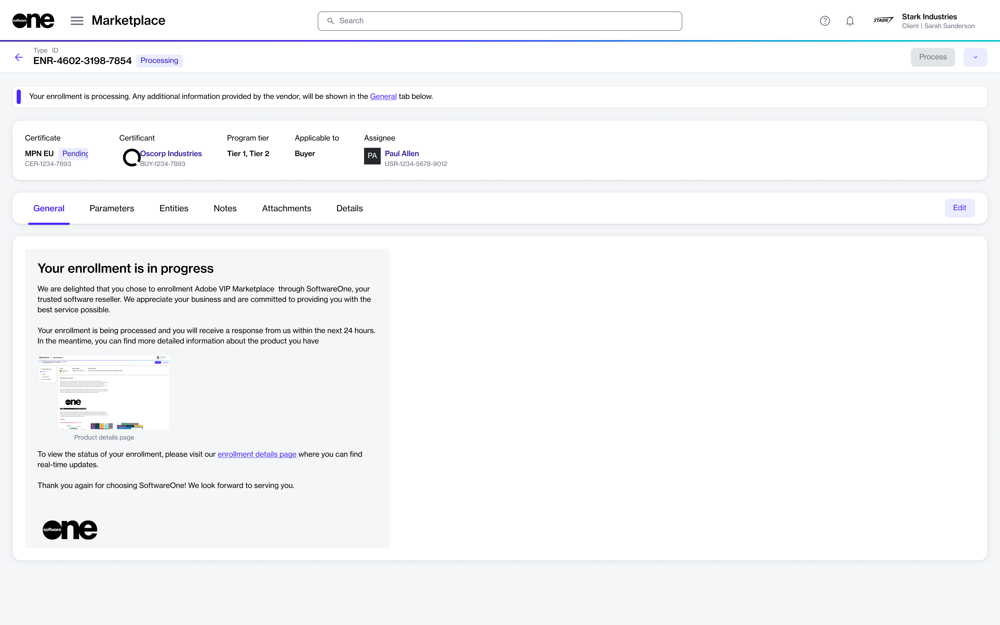

# Enrollments

In the Marketplace Platform, enrollment is the process of registering in a specific vendor program.&#x20;

Enrolling in a program makes you eligible for all benefits and incentives associated with that program. The benefits may include reduced pricing, special offers, renewal discounts, and so on.

To enroll in a program, you must fulfill all specified requirements, which may include submitting necessary documentation or meeting certain criteria established by the vendor. If you meet all the requirements, the vendor enrolls you in the program and issues a certificate.&#x20;

The process of enrolling in a program through the Marketplace Platform involves the following steps:

1. Select the program from the catalog on the [Programs ](../programs.md)page.
2. Provide information according to the program's parameters, including your partner details.&#x20;
3. Review and submit the enrollment request to the vendor.&#x20;
   * If your request is approved, you'll receive a certificate.
   * If the vendor requires more information to process your enrollment, your request will move to the **Querying** state. The [enrollment details page](./#subscription-details) will specify the information you must provide.
   * If you don't meet the program's criteria or requirements, your enrollment request will be rejected.

You can view your enrollments on the **Enrollments** page in the platform. The page is available under **Marketplace** in the main menu.

<figure><figcaption>
Enrollments page
</figcaption></figure>

The enrollments page displays all Marketplace enrollments, including the ones that are completed as well as being processed.&#x20;

For each enrollment, you can view various details, including the enrollment ID, the name of the program, the enrollment status, and more.

## Viewing enrollment details 

To view the full details of an enrollment, select the enrollment ID on the **Enrollments** page.

<figure><figcaption>
Enrollment details page
</figcaption></figure>

The details page displays extended information for your selected enrollment.&#x20;

At the top of the details page, you can see details, such as the enrollment ID and current status. A status message is also displayed to provide further context. The top section also displays links to properties, including the program, certificate, and certificant.

The details page also contains the following tabs:

<table><thead><tr><th width="261">Tab</th><th>Description</th></tr></thead><tbody><tr><td><strong>General</strong></td><td>Displays the latest information for the enrollment, along with the status. </td></tr><tr><td><strong>Parameters</strong></td><td>Displays the ordering and fulfillment parameters for the enrollment.</td></tr><tr><td><strong>Entities</strong> </td><td>Displays the business object linked to the enrollment. </td></tr><tr><td><strong>Notes</strong></td><td>Allows you to add or update notes using the <strong>Edit</strong> option.</td></tr><tr><td><strong>Details</strong></td><td>Displays the date and time information for any events related to the enrollment, such as when the enrollment was created.</td></tr><tr><td><strong>Attachments</strong></td><td>Displays the files attached to the enrollment.</td></tr><tr><td><strong>Audit trail</strong></td><td>Displays an audit trail including the log details and summary. To learn more, see <a href="https://docs.platform.softwareone.com/modules-and-features/settings/audit-trail">Audit Trail</a>.</td></tr></tbody></table>
