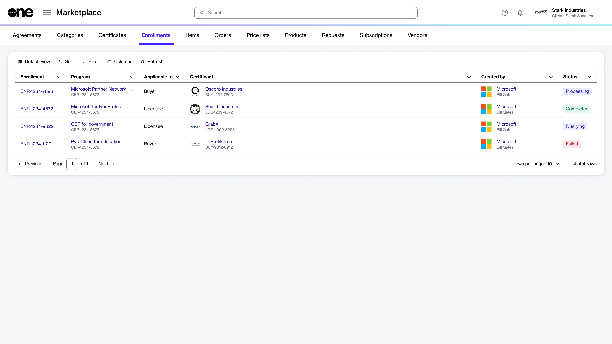

# Enrollments

Enrollment is the process of registering for a vendor program.&#x20;

Enrollment gives you access to all the benefits and incentives associated with the program. These benefits may include reduced pricing, special offers, renewal discounts, and more.&#x20;

To enroll in a program, you must meet specific requirements, such as submitting necessary documentation or meeting certain criteria established by the vendor. In the Marketplace Platform, the enrollment process typically includes these steps:

1. Choosing the program you want to enroll in.
2. Providing information according to the program's parameters.&#x20;
3. Submitting your request.&#x20;

When you are enrolled, the **Enrollments** page displays the enrollment information.

### Accessing enrollments

The **Enrollments** page displays all enrollments, regardless of the status.&#x20;

To access this page, select the main menu, then choose **Programs** > **Enrollment**.&#x20;

<figure><figcaption></figcaption></figure>

On the **Enrollments** page, you can view details, such as enrollment ID, the program name, enrollment status, and more.&#x20;

You can also select an enrollment to view detailed information organized across several tabs. The information available includes:

* General information and the current status of the enrollment.
* Parameters and entities linked to the enrollment.
* Notes and files attached to the enrollment
* Additional IDs, timestamps, and audit trail.

### Related topics


[enrollment-states.md](enrollment-states.md)



[view-enrollments.md](view-enrollments.md)



[manage-querying-enrollments.md](manage-querying-enrollments.md)



[renew-your-enrollment.md](renew-your-enrollment.md)


