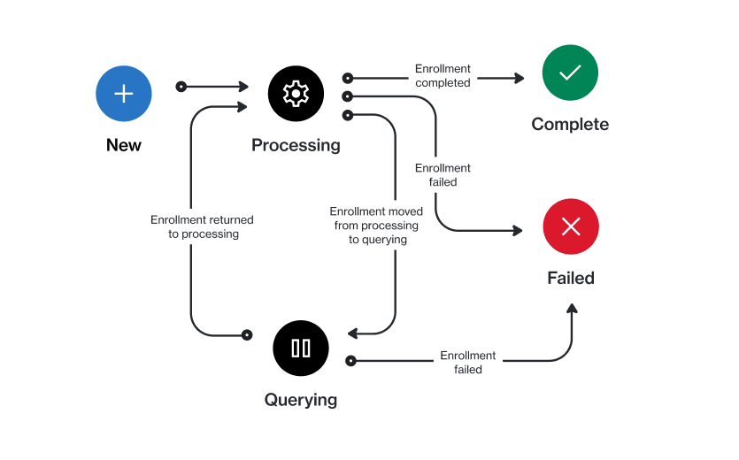

# Enrollment status

In the Marketplace Platform, enrollment is the process of registering for a vendor program.&#x20;

An enrollment can currently exist in these states: **New**, **Processing**, **Querying**, **Complete**, or **Failed**. The following diagram shows the transitions between these states:

<figure><figcaption>
The state transition diagram of an enrollment.
</figcaption></figure>

The following table provides a description of the different states:

<table data-full-width="false"><thead><tr><th width="152">State</th><th>Definition</th></tr></thead><tbody><tr><td><strong>New</strong></td><td>This is the initial status for newly created enrollments in the platform.</td></tr><tr><td><strong>Processing</strong></td><td>The enrollment has been submitted, and it's undergoing approval processing.</td></tr><tr><td><strong>Querying</strong></td><td>The vendor requires more information to process your enrollment.</td></tr><tr><td><strong>Complete</strong></td><td>The vendor has approved your enrollment and activated your certificate.</td></tr><tr><td><strong>Failed</strong></td><td>The vendor has rejected your enrollment request.</td></tr></tbody></table>
