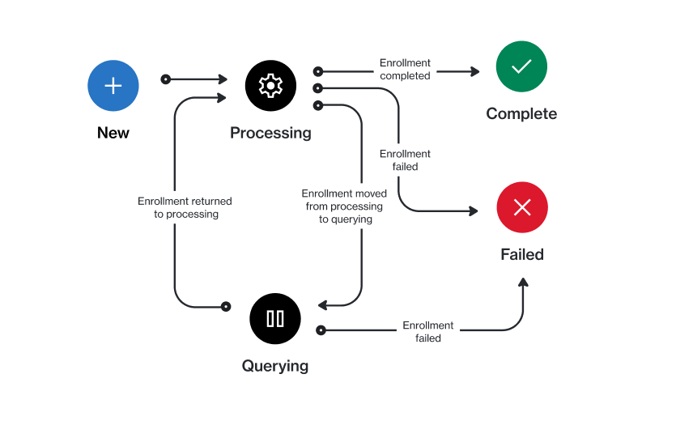

# Enrollment States

In the Marketplace Platform, an enrollment goes through several states (also known as statuses) during its lifecycle.&#x20;

The following diagram shows the possible states and the transitions between these states:

<figure><figcaption>
Enrollment state transition
</figcaption></figure>

<table data-full-width="false"><thead><tr><th width="152">State</th><th>Definition</th></tr></thead><tbody><tr><td><strong>New</strong></td><td>This is the initial status for newly created enrollments in the platform.</td></tr><tr><td><strong>Processing</strong></td><td>The enrollment has been submitted, and it's undergoing approval processing.</td></tr><tr><td><strong>Querying</strong></td><td>The vendor requires more information to process your enrollment.</td></tr><tr><td><strong>Complete</strong></td><td>The vendor has approved your enrollment and activated your certificate.</td></tr><tr><td><strong>Failed</strong></td><td>The vendor has rejected your enrollment request.</td></tr></tbody></table>
