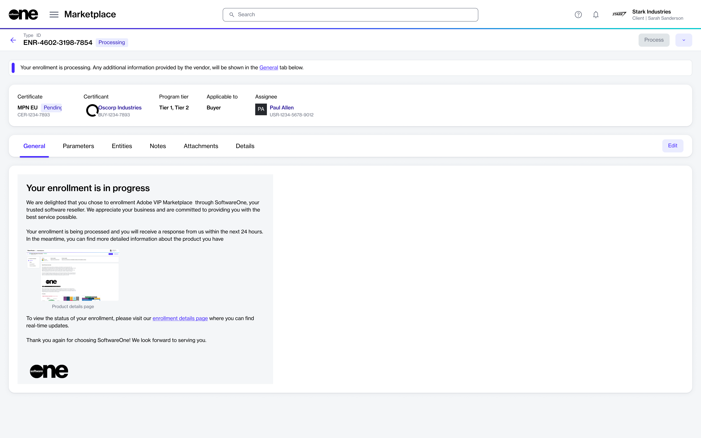

# View enrollments

This topic describes how to view a list of enrollments in your account, as well as details about a specific enrollment.

### Viewing enrollments

To view your enrollments:&#x20;

1. Go to **Program** > **Enrollments**.
2. View the list of enrollments displayed on the page.

<figure><figcaption>
Use the Enrollments page to view and manage enrollments.
</figcaption></figure>

### Viewing enrollment details 

On the enrollment details page, you can view extended information for the enrollment. Some information is read-only, while others include links that allow you to navigate to further details.

To view the enrollment details:

1. Go to **Program** > **Enrollments**.
2. Select the enrollment you want to view. The enrollment details page opens.

<figure><figcaption>
Use the enrollment details page to view additional details.
</figcaption></figure>

3. Use the tabs on the **enrollment details** page to view additional information:

<table><thead><tr><th width="135">Tab</th><th>Description</th></tr></thead><tbody><tr><td><strong>General</strong></td><td>Displays the most up-to-date information for the enrollment.</td></tr><tr><td><strong>Parameters</strong></td><td>Displays the ordering and fulfillment parameters for the enrollment.</td></tr><tr><td><strong>Entities</strong> </td><td>Displays the business object linked to the enrollment. </td></tr><tr><td><strong>Notes</strong> </td><td>Allows you to add or update notes using the <strong>Edit</strong> option.</td></tr><tr><td><strong>Details</strong> </td><td>Displays the date and time information for any events related to the enrollment, such as when the enrollment was created.</td></tr><tr><td><strong>Attachments</strong> </td><td>Displays files attached to the enrollment.</td></tr><tr><td><strong>Audit trail</strong></td><td>Displays the <a href="../../settings/audit-trail.md">audit trail</a> for the enrollment.</td></tr></tbody></table>
