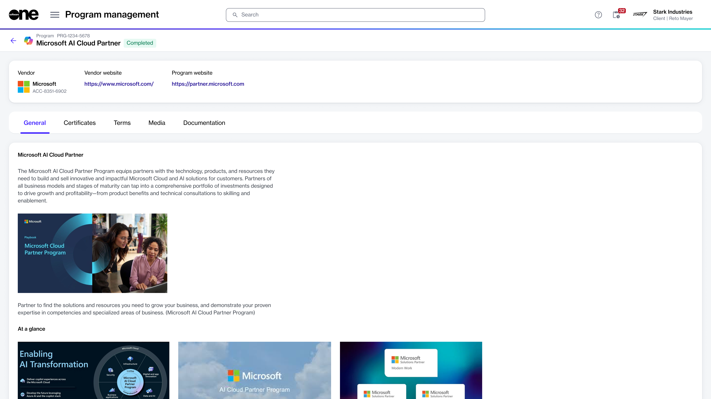

# Programs

The **Programs** page in the platform displays all active vendor programs that are open for enrollment. You can access this page by selecting the **Marketplace** option in the main navigation menu.

By enrolling in a program, you gain access to all the benefits associated with that program. To learn about the Microsoft partner programs available for enrollment through the Marketplace, see [Partner Programs](../../extensions/microsoft-cloud-solution-provider/partner-programs.md).&#x20;

## Viewing program details

To view the full details of a program, select the program on the **Programs** page.

<figure><figcaption>
Details page of a program
</figcaption></figure>

At the top of the details page, you can see general program details. The details page also contains the following tabs:

<table><thead><tr><th width="176">Tab</th><th>Description</th></tr></thead><tbody><tr><td><strong>General</strong> </td><td>Describes the program requirements and what you'll need to enroll in the program.</td></tr><tr><td><strong>Certificates</strong></td><td>Displays your certificates for the program. You can also enroll in the program using the <strong>Add</strong> option. </td></tr><tr><td><strong>Terms</strong></td><td>Shows the terms and conditions applicable to the program.</td></tr><tr><td><strong>Media</strong></td><td>Shows the image and video files attached to the program by the vendor or SoftwareOne.</td></tr><tr><td><strong>Documentation</strong></td><td>Shows supporting documentation that may provide additional context about the program.</td></tr></tbody></table>

## Additional actions

From the Program details page, you can enroll in a program using the **Add** option on the **Certificates** tab. See [Marketplace for Partners ](../../marketplace-platform/getting-started/marketplace-for-partners/)for details on how to enroll in a specific program.
