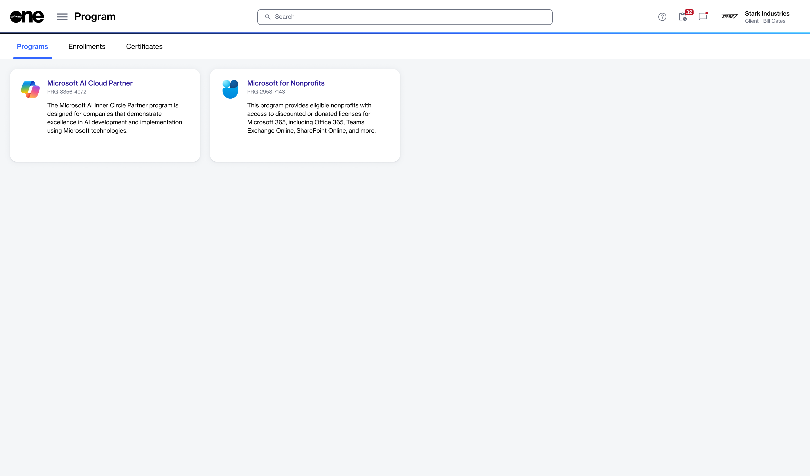
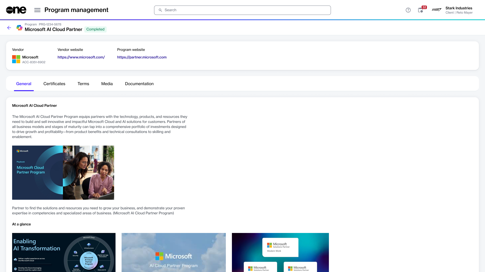

# Programs

The **Programs** page in the platform displays all programs that are active and open for enrollment.&#x20;

By enrolling in a program, you gain access to all the benefits associated with that program. For information on the Microsoft partner programs available for enrollment through the Marketplace, see [Partner Programs](../../extensions/microsoft-cloud-solution-provider/products-and-programs/partner-programs.md).&#x20;

### Accessing programs

The **Programs** page displays all active programs that you can enroll into.

To navigate to the **Programs** page, select the main menu, then choose **Program** > **Programs**. The list of programs is displayed. From this page, you can select a program to open its details page.

<figure><figcaption>
The Programs page in the SoftwareOne Marketplace.
</figcaption></figure>

### Viewing program details

On the **program details** page, you can view detailed information for the program. Some information is read-only, while others include links you can use to navigate to further details.

To view the program details:

1. Go to the **Programs** page.
2. Select the program you want to view. &#x20;
3. On the details page, review the program information.

<figure><figcaption>
The details page of a program.
</figcaption></figure>

3. Use the tabs on the **program details** page to view additional information:

<table><thead><tr><th width="171">Tab</th><th>Description</th></tr></thead><tbody><tr><td><strong>General</strong></td><td>Describes the program requirements and what you'll need to enroll in the program.</td></tr><tr><td><strong>Certificates</strong></td><td>Displays your certificates for the program. You can also enroll in the program using the <strong>Add</strong> option. </td></tr><tr><td><strong>Terms</strong></td><td>Shows the terms and conditions applicable to the program.</td></tr><tr><td><strong>Media</strong></td><td>Shows the image and video files attached to the program by the vendor or SoftwareOne.</td></tr><tr><td><strong>Documentation</strong></td><td>Shows supporting documentation that may provide additional context about the program.</td></tr></tbody></table>

### Related topics


[how-to-enroll-in-the-softwareone-csp-partner-program.md](../../marketplace-platform/getting-started/marketplace-for-partners/how-to-enroll-in-the-softwareone-csp-partner-program.md)



[how-to-enroll-in-the-csp-partner-program.md](../../marketplace-platform/getting-started/marketplace-for-partners/how-to-enroll-in-the-csp-partner-program.md)

