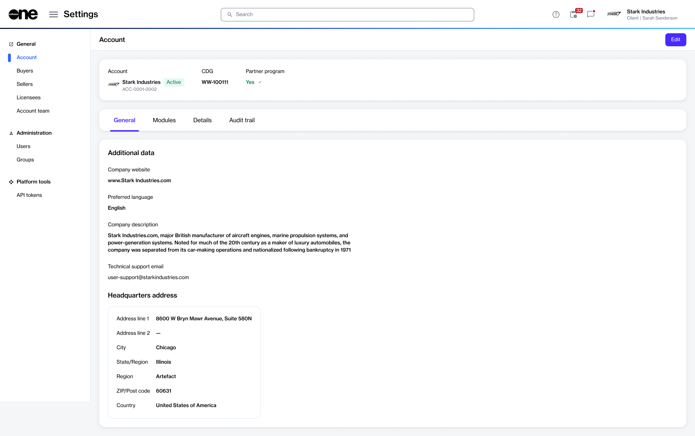

# Account

An account enables a company or organization to sign in to the Marketplace platform and access the modules and features enabled for your account by SoftwareOne.

The platform supports various account types, including client and vendor accounts, each offering different functionalities based on the account type.&#x20;

### Accessing the Account page

The **Accounts** page allows account administrators to view details, such as your account name and ID, company information, the Marketplace modules SoftwareOne has enabled for your account, the date and time your account was created, and more. Admins can also edit some of the account information.

To navigate to the **Accounts** page, select the main menu, then choose **Settings** > **Accounts**.&#x20;

<figure><figcaption>
The Account page in the platform.
</figcaption></figure>

### Related topics


[update-account-information.md](update-account-information.md)

