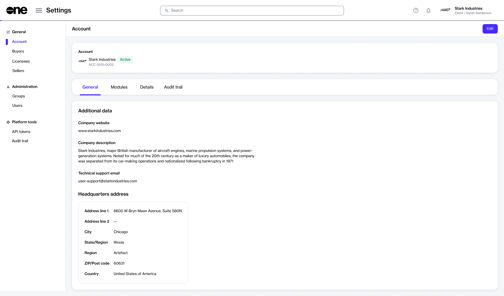

# Account

An account enables a company or organization to sign in to the Marketplace platform and access the modules and features enabled for your account by SoftwareOne.

The platform supports various account types, including client and vendor accounts, each offering different functionalities based on the account type.&#x20;

Account administrators can view account information on the **Account** page.

<figure><figcaption>
Your account page
</figcaption></figure>

The page displays general information associated with your account, such as your account name, status, and ID, and is organized into the following tabs:

<table><thead><tr><th width="223">Tab</th><th>Description</th></tr></thead><tbody><tr><td><strong>General</strong></td><td>Shows additional details for your account, including your company website, a description, support email address, and headquarters address.</td></tr><tr><td><strong>Modules</strong> </td><td>Lists the modules that SoftwareOne has enabled for your account.</td></tr><tr><td><strong>Details</strong></td><td>Displays the creation date and time of your account, as well as the last updated date and time.</td></tr><tr><td><strong>Audit trail</strong></td><td>Provides a record of all changes and events within your account. For each audit entry, you can view the log details and summary. To learn more, see <a href="../audit-trail.md">Audit Trail</a>.</td></tr></tbody></table>

## Additional actions

You can update specific information using the **Edit** option. For instructions, see [Update Account Details](update-account-information.md).
