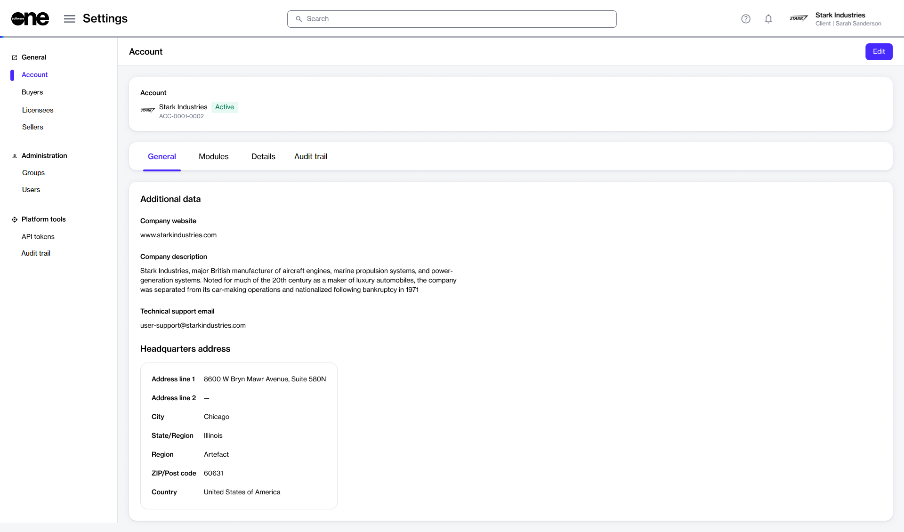

# Update Account Details

If you want to update your account information, like the account name, company details, and address, you can make these changes using the **Edit** option on the **Account** page.&#x20;


**Need to update your profile or personal settings?**

See [Manage your profile](../../../marketplace-platform/getting-started/interface/manage-profile.md) to learn about updating your profile picture, profile name, preferred language, and more.


## Updating your account details

To update your account details:

1. Navigate to the **Account** page.
2. Select **Edit** to start the **Edit account** wizard.

<figure><figcaption>
The Account page showing your account information.
</figcaption></figure>

3. Change the **General** settings as necessary:
   * **Logo** - Update the logo for your account. You can upload an image by selecting **Select file** or by dragging the image into the field.
   * **Client name** - Update the name of your account. The account name is displayed in the upper right and on other pages on the platform.
4. Change the **Additional data** settings as necessary:
   * **Company website** - Enter the URL for your company website.
   * **Technical support email** - Enter an email address for your technical support.
   * **Company description** - Enter a description of your company.
5. Change the **Headquarters address** settings as necessary:
   * **Address line 1** - Enter the first line of your company address.
   * **Address line 2** - Enter additional details or secondary address information.
   * **City** - Enter the city for your address.
   * **State/region** - Select the state or region for your address.
   * **ZIP/postcode** - Enter the ZIP or postal code for your address.
   * **Country** - Select the country for your address.
6. Select **Save**. A message is displayed stating that your account settings have been updated.
