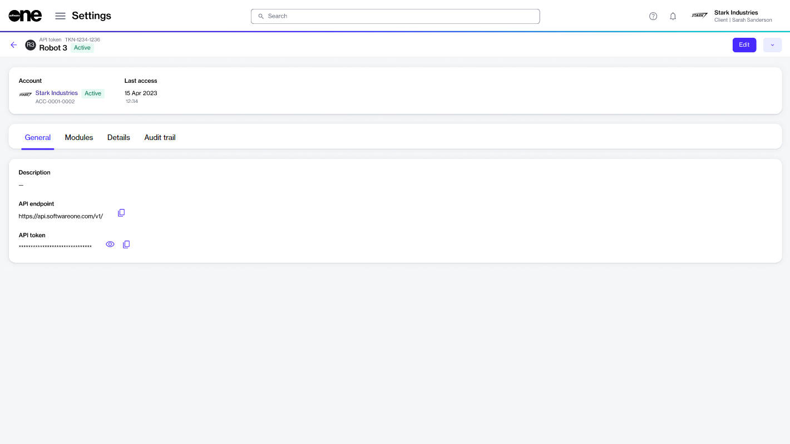

# API Tokens

The Marketplace Platform uses API tokens to authenticate requests to the [REST API](../../../developer-resources/rest-api/).

Your API token must be included in the **Authorization** HTTP header with the **Bearer** prefix for authentication. For example, the following request could be used to retrieve a list of buyers:

```http
GET https://api.platform.softwareone.com/public/v1/accounts/buyers
Authorization: Bearer {TOKEN_VALUE}
```

Your API keys have permissions assigned to them, so keep them secure. Do not share your secret API keys in public areas, like GitHub or client-side code.&#x20;

All API requests must be made over **HTTPS**. Calls made over plain HTTP will fail. API requests without authentication will also fail.

### Viewing API tokens

To view and manage your API tokens, navigate to the **API tokens** page.

The page shows all tokens associated with your account. For each token, you can view details such as the token's name, the name of the person who created the token, the date of creation, and the token's [status](token-states.md).&#x20;

From this page, you can easily manage your existing tokens and edit token details.

<div data-with-frame="true"><figure><figcaption><p>The API tokens page in the platform.</p></figcaption></figure></div>

### Viewing token details

To view the details page of a token:

1. Navigate to the **API tokens** page.
2. (Optional) Use filters to find the desired token.
3. Select the token to view general information, such as the token's name, marketplace ID, and status.&#x20;

<div data-with-frame="true"><figure><figcaption><p>The details page of an API token.</p></figcaption></figure></div>

4. Use the following tabs to access additional related information:
   * **General** - Displays the token's description and allows you to show, hide, and copy the values.
   * **Modules** - Displays the modules that the API token has been granted access to within the scope of an account.
   * **Details** - Displays the date and time information for your selected token, for example, the date and time when the token was created.
   * **Audit trail** - Displays a record of events related to the token. For more information, see [Audit Trail](https://docs.platform.softwareone.com/modules-and-features/settings/audit-trail).

### Additional actions

You can perform various actions on the details page. The available actions depend on the token's current status:

* [Edit the existing token](edit-api-token.md)
* [Copy your API token](copy-api-token.md)
* [Delete a token permanently](delete-api-token.md)
* [Enable or disable a token](enable-or-disable-api-token.md)
