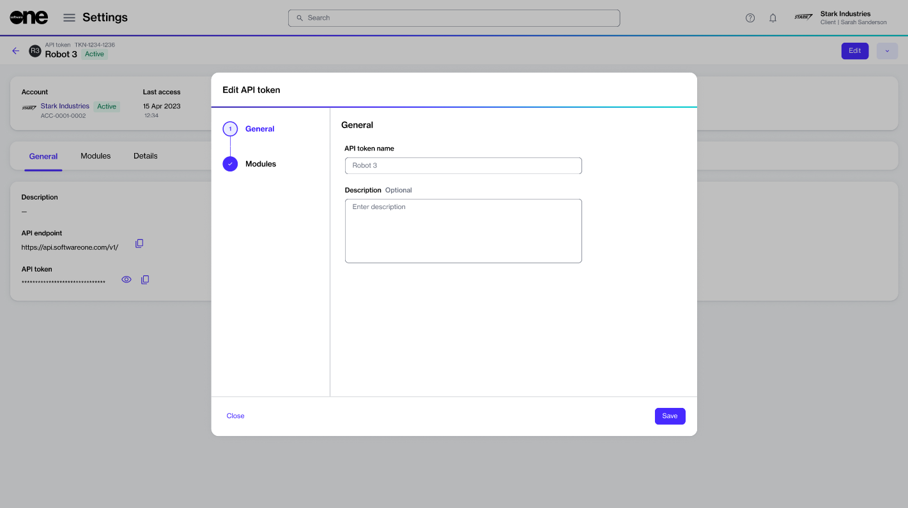

# Edit API Token

You can update an API token’s description and change the access scope through the **Edit** option on the token's details page.

## Editing an API token

To update the token details:

1. Navigate to the **API tokens** page. Then, find the token you want to update.&#x20;
2. Do one of the following:
   * Select the actions icon (**•••**) and select **Edit**.
   * Select the token. When the details page opens, select **Edit** in the upper right. The **Edit API token** page opens.&#x20;

<figure><figcaption>
The Edit API token page
</figcaption></figure>

3. Modify the information you need to change:
   1. In the **General** step, you can update the token's name and description.
   2. In the **Modules** step, you can update the access scope for the **Modules**.
4. Select **Save**. A confirmation message is displayed stating that your token has been updated.&#x20;
