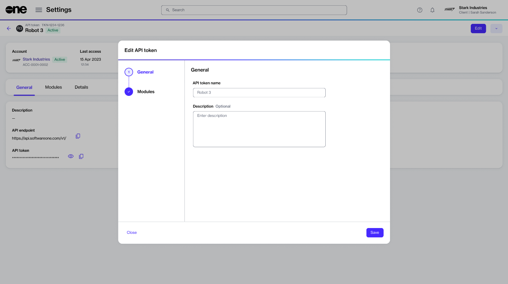

# Edit API tokens

You can update an API token’s description and change the access scope through the **Edit** option on the token's details page.

### Editing an API token

To update the token details:

1. Go to **Settings** > **API tokens**.&#x20;
2. Find the token you want to update.&#x20;
3. Do one of the following:
   * Select the actions icon (**•••**) and select **Edit**.
   * Select the token. Then, on the details page, select **Edit**. The **Edit API token** page opens.&#x20;

<figure><figcaption>
The Edit API token page in the platform.
</figcaption></figure>

3. Update the details as necessary:
   * **General** - You can update the token name and description.
   * **Modules** - You can update the access scope for the **Modules**.
4. Select **Save**. A confirmation message is displayed stating that the token is updated.&#x20;
