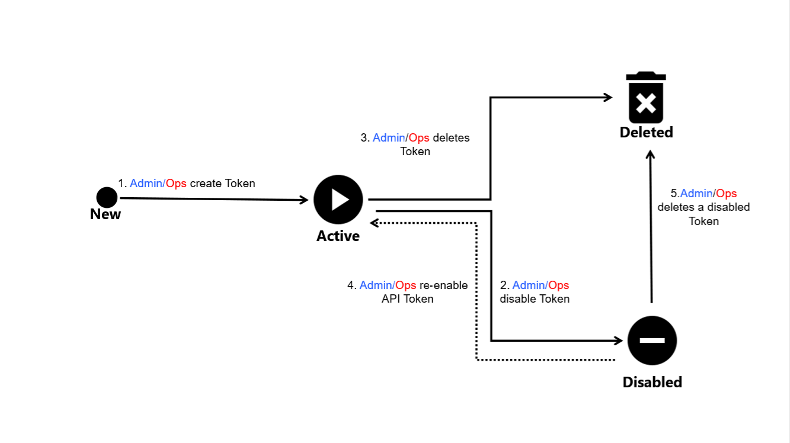

# Token States

A token can have multiple states during its lifecycle in the Marketplace Platform.

The following diagram shows the possible states and the transition between these states:

<figure><figcaption>
API token state transition
</figcaption></figure>

These states are displayed as Status within the platform. They are also displayed as an icon beside the token name and ID on the details page.

<table><thead><tr><th width="124">State</th><th>Definition</th></tr></thead><tbody><tr><td><strong>Active</strong></td><td>
The token has been authenticated in the account. 

It will allow access to the endpoint.
</td></tr><tr><td><strong>Disabled</strong></td><td>
The token has been temporarily deactivated. 

Any attempts to access the endpoint will return an error.
</td></tr><tr><td><strong>Deleted</strong></td><td>
The token has been permanently removed from the system. 

This state is not visible to the client or vendor account users.
</td></tr></tbody></table>

## Related topics


[create-api-token.md](create-api-token.md)



[edit-api-token.md](edit-api-token.md)



[copy-api-token.md](copy-api-token.md)



[delete-api-token.md](delete-api-token.md)



[enable-or-disable-api-token.md](enable-or-disable-api-token.md)

